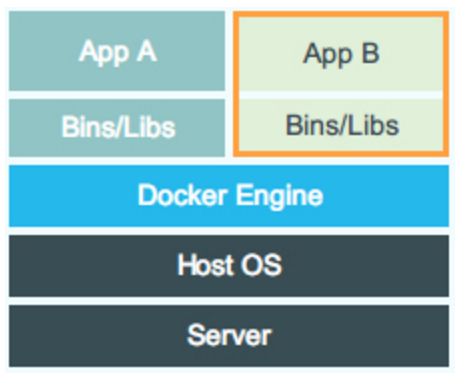


# 作业报告
***
## 1. 阅读Mesos论文《Mesos: A Platform for Fine-Grained Resource Sharing in the Data Center》，并了解数据中心操作系统的概念

代数的就看撒来到解放路凯撒


## 2. 了解虚拟机和容器技术，用自己的话简单叙述、总结并对比
**虚拟机**：虚拟机是一个模拟真实计算机的虚拟系统，它包括一台真正计算机除了硬件设备以外的部分：操作系统、库以及其上的应用。虚拟机通过在软件层面上模拟硬件的操作，让虚拟机的操作系统非直接运行在硬件上。其中那个模拟硬件，为上层操作系统提供支持的软件叫做hypervisor，它可以运行在真机硬件或者真机的操作系统上。运行在在hypervisor之上的虚拟机彼此隔离，互相独立。其结构可以用下面这一张图表示：
	

**容器**：容器实际上也是一个虚拟系统，但是它虚拟的层面和虚拟机不一样。容器直接复用了真机的操作系统内核,然后在其上通过namespace等技术，将整个运行时环境（包括全部所需文件）一起打包隔离。由于相对虚拟机少了一层抽象（硬件模拟层），所以速度会比虚拟机快很多。容器的结构可以用下面这一张图表示(最火的Docker的架构)：
	

相比于虚拟机，容器拥有更高的资源使用效率，因为它并不需要为每个应用分配单独的操作系统——实例规模更小、创建和迁移速度也更快。这意味相比于虚拟机，单个操作系统能够承载更多的容器；在相同的硬件设备当中，可以部署数量更多的容器实例。然而，单个操作系统有可能引起影响所有相关实例的单点事故。比如，恶意软件或者主机操作系统崩溃可能禁用或者影响所有容器。此外，容器易于迁移，但是只能被迁移到具有兼容操作系统内核的其他服务器当中，这样会无形中减少迁移选择。


## 3. 从github上获取mesos项目，切换到tag为1.1.0的版本自己build并运行起来


## 4. 运行Spark on Mesos([说明](http://spark.apache.org/docs/latest/running-on-mesos.html))，以不同并行度运行两次wordcount程序并比较，需要在报告中详细说明并附资源使用情况及时间花费截图


## 5. 叙述自己对这些软件技术与具体安装运行过程的看法，对于觉得存在问题的地方可以自己查阅资料或咨询助教








