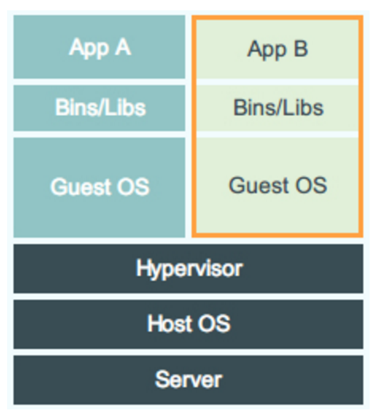


# 作业报告
***
## 1. 阅读Mesos论文《Mesos: A Platform for Fine-Grained Resource Sharing in the Data Center》，并了解数据中心操作系统的概念

	代数的就看撒来到解放路凯撒


## 2. 了解虚拟机和容器技术，用自己的话简单叙述、总结并对比
>*虚拟机*：虚拟机是一种模拟系统，它通过在软件模拟硬件的操作，让虚拟机的操作系统非直接运行在硬件上。其中那个模拟硬件，为上层操作系统提供支持的软件叫做hypervisor。可以用一张图表示。


容器

|        | 虚拟机 | 容器 |
| :----- | :-------- | :------ |
| asd   |  dasd   | asdas |



## 3. 从github上获取mesos项目，切换到tag为1.1.0的版本自己build并运行起来


## 4. 运行Spark on Mesos([说明](http://spark.apache.org/docs/latest/running-on-mesos.html))，以不同并行度运行两次wordcount程序并比较，需要在报告中详细说明并附资源使用情况及时间花费截图


## 5. 叙述自己对这些软件技术与具体安装运行过程的看法，对于觉得存在问题的地方可以自己查阅资料或咨询助教







