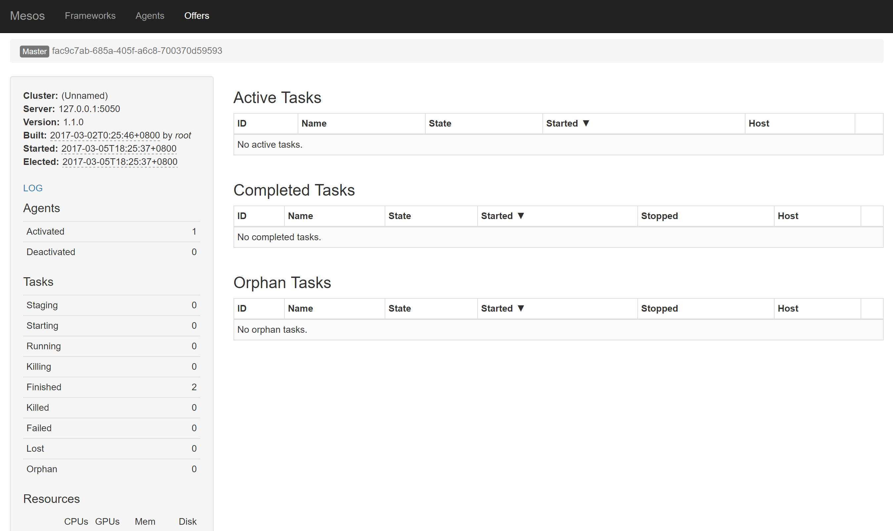
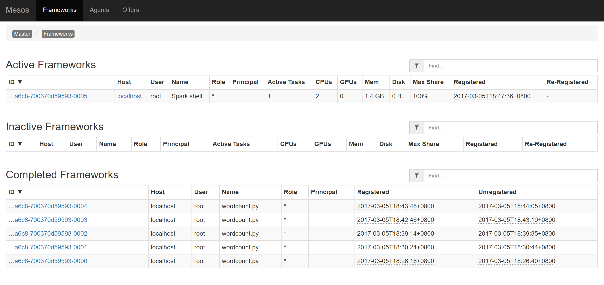
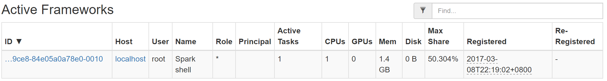
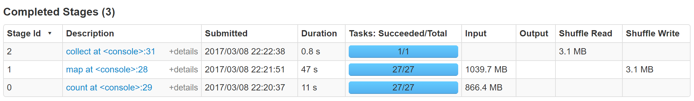
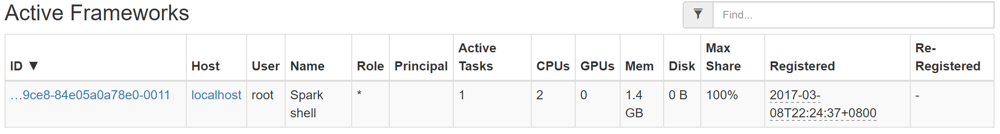
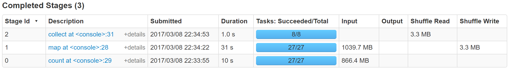


# 作业报告
***
## 1. 阅读Mesos论文《Mesos: A Platform for Fine-Grained Resource Sharing in the Data Center》，并了解数据中心操作系统的概念

论文主要介绍了mesos这样一个在不同的计算框架（比如Hadoop和MPI）间合理分配集群中的硬件资源的平台。mesos可以将集群中的计算机的资源细粒度地分配给需要的运算框架（比如一台真实机器的多核CPU分给若干个框架使用）。

#### mesos架构



如上图所示，mesos有一个master进程管理所有运行在集群结点上的slave守护进程，然后各个分布式计算框架将其计算任务放在slave上运行。每一个计算框架由两个部分组成：一个是scheduler，向master注册并且接受master分配的运算资源；另一个是executer，运行在slave结点上，负责运行框架的任务。

#### mesos资源分配过程

master通过一个叫resource offer的过程将计算资源分配给计算框架，其模型如下图所示:



过程为:
1. slave 1 报告给master此处有4个CPU和4GB的内存可用。然后master启动分配模块，得知按当前分配策略，应该先提供给框架1全部的可用资源
2. master向框架1发送资源邀约（offer），告知框架1可用资源的情况
3. 框架1的scheduler回应master，需要<2个CPU,1 G RAM>给第一个任务,<1个CPU,2 G RAM>给第二个任务
4. 最后master将任务发送给适合的slave，运行。由于还剩下1个CPU和1 G RAM仍然可用，master的分配模块可能会将它们提供给框架2 
5. 
当然，mesos也提供给计算框架拒绝master的资源邀约的权利和能力。

#### 其他技术细节

* mesos实现了两种资源分配方式：一种公平分配另一种带有优先级。
* mesos通过操作系统容器技术（OS container technologies）隔离资源。
* 通过实现过滤器（filter）减少不必要的master对框架的资源邀约。
* 如果一个框架对资源邀约长时间没反应，master收回资源并向下一个框架发起邀约
* mesos通过zookeeper票选master，一旦当前master失效，其管理的slave和scheduler会链接到下一个被选上的master
* 对于executer的失效，mesos会报告给scheduler，然后框架根据自身的设计处理这些失效
* mesos也允许框架注册多个scheduler，这样当一个scheduler失效另一个就可以取而代之

#### 数据中心操作系统

我们可以将mesos和我们单机的Linux系统做一个对比:



mesos和单机Linux的共同点是：它们都是一个很好的抽象层，负责提供计算资源给上层的应用程序，对于Linux是普通单机应用程序对于mesos则是分布式计算框架。然而本质上，它们的理念、在计算机系统层次中所处的位置都是相似的，几乎没什么区别。
但是，相较于Linux，mesos只完成了Linux的部分工作，它本身没有与之配套的系统软件，也没有给人交互的方便的命令行或者GUI。因此mesos本身还不能称之为一个完整的操作系统，将它与Linux内核类比是合适的。当然，现在也有基于mesos，提供一套完整工具的数据中心操作系统，比如Mesosphere DCOS。






## 2. 了解虚拟机和容器技术，用自己的话简单叙述、总结并对比
**虚拟机**：虚拟机是一个模拟真实计算机的虚拟系统，它包括一台真正计算机除了硬件设备以外的部分：操作系统、库以及其上的应用。虚拟机通过在软件层面上模拟硬件的操作，让虚拟机的操作系统非直接运行在硬件上。其中那个模拟硬件，为上层操作系统提供支持的软件叫做hypervisor，它可以运行在真机硬件或者真机的操作系统上。运行在在hypervisor之上的虚拟机彼此隔离，互相独立。其结构可以用下面这一张图表示：



**容器**：容器实际上也是一个虚拟系统，但是它虚拟的层面和虚拟机不一样。容器直接复用了真机的操作系统内核,然后在其上通过namespace等技术，将整个运行时环境（包括全部所需文件）一起打包隔离。由于相对虚拟机少了一层抽象（硬件模拟层），所以速度会比虚拟机快很多。容器的结构可以用下面这一张图表示(最火的Docker的架构)：



相比于虚拟机，容器拥有更高的资源使用效率，因为它并不需要为每个应用分配单独的操作系统——实例规模更小、创建和迁移速度也更快。这意味相比于虚拟机，单个操作系统能够承载更多的容器；在相同的硬件设备当中，可以部署数量更多的容器实例。然而，单个操作系统有可能引起影响所有相关实例的单点事故。比如，恶意软件或者主机操作系统崩溃可能禁用或者影响所有容器。此外，容器易于迁移，但是只能被迁移到具有兼容操作系统内核的其他服务器当中，这样会无形中减少迁移选择。


## 3. 从github上获取mesos项目，切换到tag为1.1.0的版本自己build并运行起来

已完成




## 4. 运行Spark on Mesos([说明](http://spark.apache.org/docs/latest/running-on-mesos.html))，以不同并行度运行两次wordcount程序并比较，需要在报告中详细说明并附资源使用情况及时间花费截图

spark on mesos 已成功运行



我用了spark examples里面自带的python编写的wordcount程序来计算《安娜卡列尼娜》原文(1.8M)中各词出现的次数。由于原数据量较小，实验效果不明显，我将其重复500次，形成了一个900M的文件。资源使用情况如下：



我通过设置spark-defaults.conf中的spark.core.max来设置最大可用核数，spark.default.parallism设置并行度，共测试了两组，如下：

*第一组：spark.core.max = 1, spark.default.parakkism = 1*





*第二组：spark.core.max = 2, spark.default.parakkism = 8*





从上面可以看出，速度的差距是比较显著的，尤其是在map操作上，使用两个核的比一个核的在同样多的Task（27个）之下，总时间少了50%，说明spark的并行机制起到了作用。

## 5. 叙述自己对这些软件技术与具体安装运行过程的看法，对于觉得存在问题的地方可以自己查阅资料或咨询助教

整个软件系统的安装还是比较复杂的，尤其是对于像我这种第一次接触分布式软件的人来说。主要体现在这些软件相互间依赖性强，它们不是互相独立的，而是一层建构在另一层之上的，比如装spark需要用到hadoop的HDFS以及scala，而hadoop又需要JAVA的支持；当配置spark on mesos时，又需要让spark与已经安装的mesos建立联系，这就需要自己写许多配置文件。有的错误还需要自己去了解软件之下的原理才知道错在哪。但是这也是暂时没什么办法的，软件面临的情况比单机复杂得多，人的需求也复杂得多，比如集群规模、单节点资源情况、任务情况等等，因此需要用户根据自身的需求配置软件。这应该也是分布式软件的复杂之处。








 