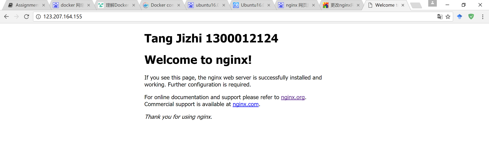
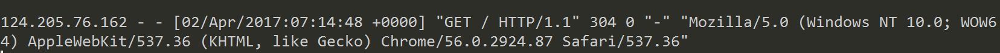
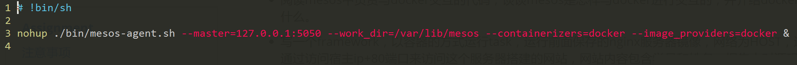
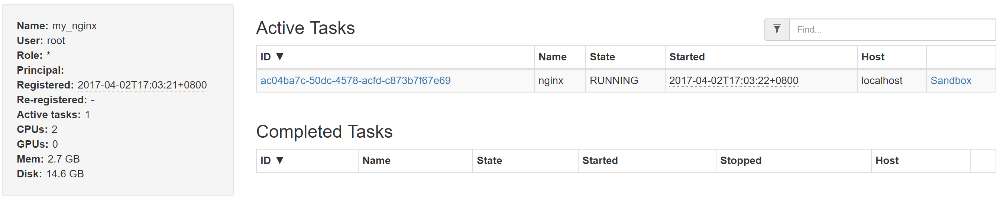
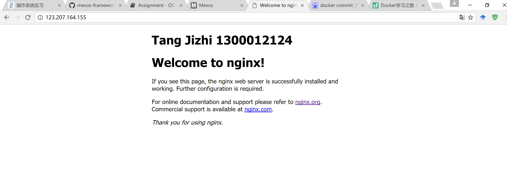

# 作业报告
***

## 1. 安装配置Docker
跟随[官网教程](https://store.docker.com/editions/community/docker-ce-server-ubuntu?tab=description)，安装步骤如下：

1. 添加软件源

```
sudo apt-get -y install apt-transport-https ca-certificates curl
curl -fsSL https://download.docker.com/linux/ubuntu/gpg | sudo apt-key add -
sudo add-apt-repository "deb [arch=amd64] https://download.docker.com/linux/ubuntu $(lsb_release -cs) stable"
```
2. 下载 Docker CE
```
sudo apt-get -y install docker-ce
```
3. 测试 Docker CE 是否正确安装
```
sudo docker run hello-world
```

测试结果如下:


Docker 已正确安装！

## 2. Docker 基本命令


#### 镜像管理

* 查看所有镜像
  ```
  docker images
  ```
* 删除镜像
  ```
  docker rmi [OPTIONS] IMAGE [IMAGE...]
         -f  强制删除
  ```
* 拉取镜像
  ```
  docker pull [OPTIONS] NAME[:TAG|@DIGEST]
         -a  拉取所有tagged镜像
  ```
* 构建自己的镜像
  ```
  docker build [OPTIONS] PATH | URL -
         -f  指定要使用的Dockerfile路径
  ```

#### 容器管理

* 查看容器
  ```
  docker ps    查看正在运行的容器
         -a  查看所有的容器，包括已经停止的
  ```
* 删除容器
  ```
  docker rm [OPTIONS] CONTAINER [CONTAINER...]
         -f  通过SIGKILL信号强制删除一个运行中的容器
         -l  移除容器间的网络连接
  ```
* 停止容器
  ```
  docker stop [OPTIONS] CONTAINER [CONTAINER...]
  ```
* 启动容器
  ```
  docker start [OPTIONS] CONTAINER [CONTAINER...]
  ```
* 杀死容器
  ```
  docker kill [OPTIONS] CONTAINER [CONTAINER...]
  ```
* 创建一个新容器并运行一个命令
  ```
  docker run [OPTIONS] IMAGE {COMMAND} [ARG...]
      -d：后台运行容器，并返回容器id
      -i：交互式运行，通常与-t同时使用
      -t：为容器重新分配一个伪输入终端，通常与-i同时使用
      -p：指定端口或IP进行映射
      --name="NAME"：为容器指定一个名称
      --network="NETWORK_NAME"：选择一个网络
  ```

#### 网络管理
* 列出网络
  ```
  docker network ls
  ```

* 查看网络情况
  ```
  docker network inspect
  ```
* 创建网络
  ```
  docker network create
  ```
* 将一个容器链接进入网络
  ```
  docker network connect
  ```

## 3. 在Docker上搭建nginx服务器

#### 1. 创建基础为ubuntu的Docker镜像
从Docker Hub上找到ubuntu的镜像([网址](https://hub.docker.com/_/ubuntu/))，输入命令
```
sudo docker pull ubuntu:latest
```
创建ubuntu容器,命名为nginx
```
sudo docker run -it --name="my_nginx" ubuntu /bin/bash
```
于是一个纯ubuntu环境搭建好了

退出之后可以使用如下命令重新运行该容器
```
sudo docker start -i my_nginx
```

#### 2. 搭建nginx服务器

更新软件源
```
apt-get update
```
安装 gcc g++ 依赖库
```
apt-get install build-essential
apt-get install libtool
```
安装 pcre 依赖库
```
apt-get install libpcre3 libpcre3-dev
```
安装 zlib 依赖库
```
apt-get install zlib1g-dev
```
安装 ssl 依赖库
```
apt-get install openssl
```
安装 nginx ([nginx网址](http://nginx.org))
```
# 下载最新版本
wget http://nginx.org/download/nginx-1.11.12.tar.gz
# 解压
tar -zxvf nginx-1.11.12.tar.gz
# 进入解压目录
cd nginx-1.11.12
# 配置
./configure --prefix=/usr/local/nginx
# 编译
make
# 安装
make install 
```
接着修改``/usr/local/nginx/html/index.html``令其显示姓名学号

然后直接运行 nginx 即可
```
/usr/local/nginx/sbin/nginx
```
可以使用``docker commit``命令保存该镜像
#### 3. 搭建网络并将容器接入
创建名为 my_network 的网络，模式为bridge（默认）
```
sudo docker network create my_network
```
连接容器和网络，并检查容器是否正确连入网络
```
sudo docker network connect my_network my_nginx
sudo docker network inspect my_network
```
结果如下图，容器已正确连入


由于我的宿主机没有图形界面，为了看到显示的效果，我通过保存的镜像重新创建一个容器，将容器的80端口映射到宿主机的80端口。然后通过浏览器访问结果如下:



容器内新增log如下:



## 4. Docker网络模式

#### 默认网络

当安装了 Docker ，它会自动创建三个网络，可以通过``docker network ls``命令列出:


#### bridge 网络

bridge 网络表示所有 Docker 安装中都存在的 docker0 网络。除非使用 docker run –net=选项另行指定，否则 Docker 守护进程默认情况下会将容器连接到此网络。在主机上使用 ifconfig命令，可以看到此网桥是主机的网络堆栈的一部分。

#### null 网络

null 网络在一个特定于容器的网络堆栈上添加了一个容器。该容器不做任何网络配置，缺少网络接口。

#### host 网络

host 网络在主机堆栈上添加了一个容器。你可以发现容器中的网络配置和主机相同。host
网络和主机共享一个network namespace。

#### overlay 网络

overlay 网络在 Docker 1.9 版本中正式加入，是官方支持的跨结点通信方案。overlay网络在不改变现有网络基础设施的前提下，通过某种约定通信协议，把二层报文封装在IP报文之上的新的数据格式

## 5. Docker与Mesos交互

Mesos支持使用 Docker 容器作为一个 Task 或者一个 Executor

* 当以 Task 方式运行时。需要在 Taskinfo 中设置 command 和 container 域。Containerinfo 中需要包含 Docker 类型，同时 Dockerinfo要提供所需容器的镜像名。
* 当以 Executor 方式运行时。 Taskinfo 中必须设置 Executorinfo 包含一个 Containerinfo，且这个 Containerinfo 的类型时 docker。同时 Commandinfo 要设成相关的命令启动 executor。

Mesos 中与 Docker 交互的代码在``/mesos/src/docker``中

#### docker.hpp

该头文件中定义了 Docker 类，Docker 类中又有 Container 和 Image 内部类。包含了 Docker 的镜像和容器两大部分。

#### docker.cpp

该文件实现了Docker类中的大部分成员函数，实际上是根据配置组成Docker的各个命令行命令。Mesos通过这种方式，使用Docker CLI与Docker交互。

docker::run() 函数实际上相当于构成并执行``docker run IMAGE``命令，在函数中实际上是不断检查参数，并转换为适当命令格式，最后执行。函数做的事情如下:
* 检查docker信息
* 加入socket参数
* 加入run关键字
* 检查是否特权，如果是加入命令参数
* 检查资源分配，命令中加入资源分配
* 检查环境变量
* 配置docker volume
* 配置docker 网络
* 配置主机
* 配置端口映射
* 配置主机分区挂载
* 配置entrypoint
* 名字
* 最后创建一个子进程通过上述形成的命令形成容器

## 6. 写一个framework，用容器方式运行task

#### 1. 修改mesos-agent的启动命令



#### 2. 写framework

见文件[my_nginx.py](./my_nginx.py)和[my_scheduler.py](./my_scheduler.py)

由pymesos提供的API写成，整体架构依然和pymesos给出的exmaple一样，主要是scheduler的变化。scheduler.py的代码如下:
```
import re
import sys
import uuid
import logging
import time
import socket
import signal
import getpass
from threading import Thread
from os.path import abspath, join, dirname

from pymesos import MesosSchedulerDriver, Scheduler, encode_data, decode_data
from addict import Dict

TASK_CPU = 0.1
TASK_MEM = 96
TASK_NUM = 1

EXECUTOR_CPUS = 0.5
EXECUTOR_MEM = 192


class MyScheduler(Scheduler):

    def __init__(self):
        self.task_launched = 0


    # invoked when resources have been offered to this framework
    def resourceOffers(self, driver, offers):
        filters = {'refuse_seconds': 5}

        # if all tasks have been launched, return directly 
        if self.task_launched == TASK_NUM:
            return 

        # for every offer
        for offer in offers:
            # check if the offer satisfy the requirments
            cpus = self.getResource(offer.resources, 'cpus')
            mem = self.getResource(offer.resources, 'mem')
            if cpus < TASK_CPU or mem < TASK_MEM:
                continue

            # config a new task
            task = Dict()
            task_id = str(uuid.uuid4())
            task.task_id.value = task_id
            task.agent_id.value = offer.agent_id.value
            task.name = 'nginx'
            # container
            task.container.type='DOCKER'
            task.container.docker.image = 'esddse/my_nginx'
            task.container.docker.network = 'HOST'
            # command 
            task.command.shell = False
            task.command.value = '/usr/local/nginx/sbin/nginx'
            task.command.arguments=['-g','daemon off;']


            task.resources = [
                dict(name='cpus', type='SCALAR', scalar={'value': TASK_CPU}),
                dict(name='mem', type='SCALAR', scalar={'value': TASK_MEM}),
            ]

            # launch task
            driver.launchTasks(offer.id, [task], filters)

            self.task_launched += 1


    def getResource(self, res, name):
        for r in res:
            if r.name == name:
                return r.scalar.value
        return 0.0

    # invoked when the status of a task has changed
    # eg: executorDriver call sendStateUpdate()
    def statusUpdate(self, driver, update):
        # log
        logging.debug('Status update TID %s %s',
                      update.task_id.value,
                      update.state)

```

主要改动在于中间对task的设置:
```
# 这三句指定了container为Docker，并且指定了使用的镜像和网络
task.container.type='DOCKER'
task.container.docker.image = 'esddse/my_nginx'
task.container.docker.network = 'HOST'

# 这使容器创建后，用守护进程方式运行nginx，不加``-g deamon off``的话会使容器提前退出
task.command.shell = False
task.command.value = '/usr/local/nginx/sbin/nginx'
task.command.arguments=['-g','daemon off;']
```
#### 3. 运行结果





后面的网站可以通过网址([123.207.164.155](http://123.207.164.155))访问


