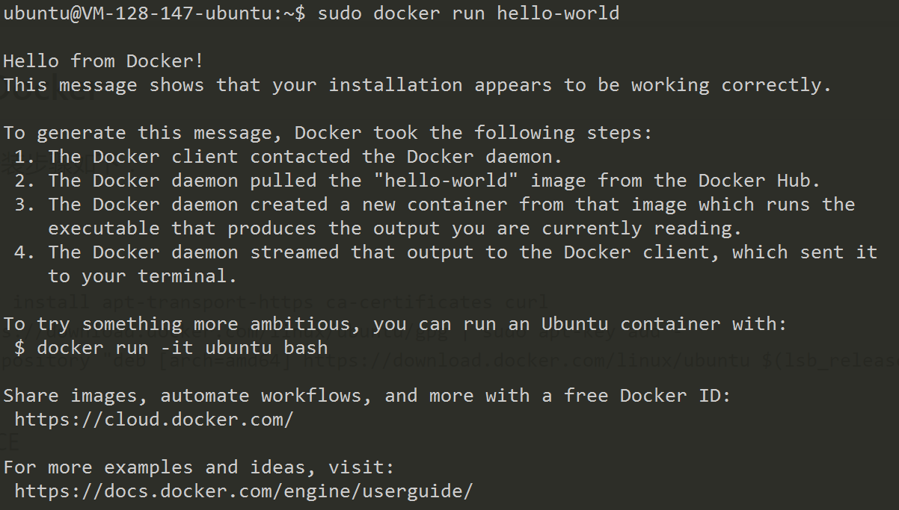
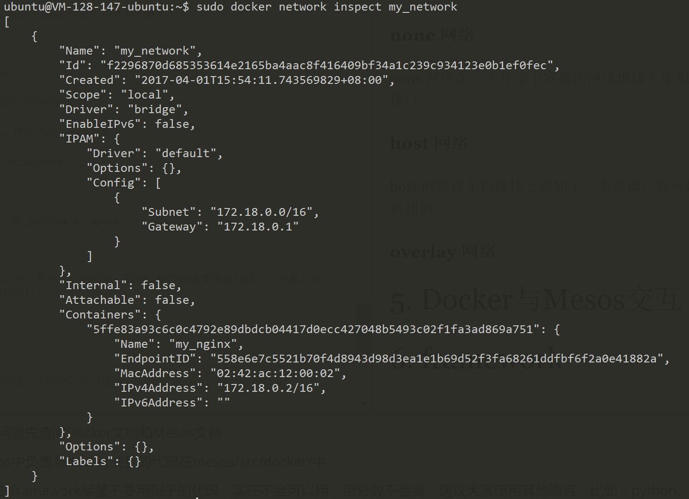
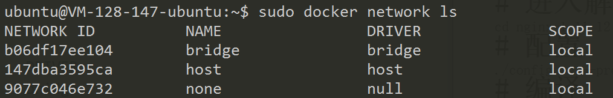

# 作业报告
***

## 1. 安装配置Docker
跟随[官网教程](https://store.docker.com/editions/community/docker-ce-server-ubuntu?tab=description)，安装步骤如下：

1. 添加软件源

```
sudo apt-get -y install apt-transport-https ca-certificates curl
curl -fsSL https://download.docker.com/linux/ubuntu/gpg | sudo apt-key add -
sudo add-apt-repository "deb [arch=amd64] https://download.docker.com/linux/ubuntu $(lsb_release -cs) stable"
```
2. 下载 Docker CE
```
sudo apt-get -y install docker-ce
```
3. 测试 Docker CE 是否正确安装
```
sudo docker run hello-world
```

测试结果如下:



Docker 已正确安装！

## 2. Docker 基本命令


#### 镜像管理

* 查看所有镜像
  ```
  docker images
  ```
* 删除镜像
  ```
  docker rmi [OPTIONS] IMAGE [IMAGE...]
         -f  强制删除
  ```
* 拉取镜像
  ```
  docker pull [OPTIONS] NAME[:TAG|@DIGEST]
         -a  拉取所有tagged镜像
  ```
* 构建自己的镜像
  ```
  docker build [OPTIONS] PATH | URL -
         -f  指定要使用的Dockerfile路径
  ```

#### 容器管理

* 查看容器
  ```
  docker ps    查看正在运行的容器
         -a  查看所有的容器，包括已经停止的
  ```
* 删除容器
  ```
  docker rm [OPTIONS] CONTAINER [CONTAINER...]
         -f  通过SIGKILL信号强制删除一个运行中的容器
         -l  移除容器间的网络连接
  ```
* 停止容器
  ```
  docker stop [OPTIONS] CONTAINER [CONTAINER...]
  ```
* 启动容器
  ```
  docker start [OPTIONS] CONTAINER [CONTAINER...]
  ```
* 杀死容器
  ```
  docker kill [OPTIONS] CONTAINER [CONTAINER...]
  ```
* 创建一个新容器并运行一个命令
  ```
  docker run [OPTIONS] IMAGE {COMMAND} [ARG...]
      -d：后台运行容器，并返回容器id
      -i：交互式运行，通常与-t同时使用
      -t：为容器重新分配一个伪输入终端，通常与-i同时使用
      -p：指定端口或IP进行映射
      --name="NAME"：为容器指定一个名称
      --network="NETWORK_NAME"：选择一个网络
  ```

#### 网络管理
* 列出网络
  ```
  docker network ls
  ```

* 查看网络情况
  ```
  docker network inspect
  ```
* 创建网络
  ```
  docker network create
  ```
* 将一个容器链接进入网络
  ```
  docker network connect
  ```

## 3. 在Docker上搭建nginx服务器

#### 1. 创建基础为ubuntu的Docker镜像
从Docker Hub上找到ubuntu的镜像([网址](https://hub.docker.com/_/ubuntu/))，输入命令
```
sudo docker pull ubuntu:latest
```
创建ubuntu容器,命名为nginx
```
sudo docker run -it --name="my_nginx" ubuntu /bin/bash
```
于是一个纯ubuntu环境搭建好了

退出之后可以使用如下命令重新运行该容器
```
sudo docker start -i my_nginx
```

#### 2. 搭建nginx服务器

更新软件源
```
apt-get update
```
安装 gcc g++ 依赖库
```
apt-get install build-essential
apt-get install libtool
```
安装 pcre 依赖库
```
apt-get install libpcre3 libpcre3-dev
```
安装 zlib 依赖库
```
apt-get install zlib1g-dev
```
安装 ssl 依赖库
```
apt-get install openssl
```
安装 nginx ([nginx网址](http://nginx.org))
```
# 下载最新版本
wget http://nginx.org/download/nginx-1.11.12.tar.gz
# 解压
tar -zxvf nginx-1.11.12.tar.gz
# 进入解压目录
cd nginx-1.11.12
# 配置
./configure --prefix=/usr/local/nginx
# 编译
make
# 安装
make install 
```
接着修改``/usr/local/nginx/html/index.html``令其显示姓名学号

然后直接运行 nginx 即可
```
/usr/local/nginx/sbin/nginx
```
可以使用``docker commit``命令保存该镜像
#### 3. 搭建网络并将容器接入
创建名为 my_network 的网络，模式为bridge（默认）
```
sudo docker network create my_network
```
连接容器和网络，并检查容器是否正确连入网络
```
sudo docker network connect my_network my_nginx
sudo docker network inspect my_network
```
结果如下图，容器已正确连入



由于我的宿主机没有图形界面，为了看到显示的效果，我通过保存的镜像重新创建一个容器，将容器的80端口映射到宿主机的80端口。然后通过浏览器访问结果如下:


## 4. Docker网络模式

#### 默认网络

当安装了 Docker ，它会自动创建三个网络，可以通过``docker network ls``命令列出:



#### bridge 网络

bridge 网络表示所有 Docker 安装中都存在的 docker0 网络。除非使用 docker run –net=选项另行指定，否则 Docker 守护进程默认情况下会将容器连接到此网络。在主机上使用 ifconfig命令，可以看到此网桥是主机的网络堆栈的一部分。

#### none 网络

none 网络在一个特定于容器的网络堆栈上添加了一个容器。该容器缺少网络接口。

#### host 网络

host 网络在主机堆栈上添加了一个容器。你可以发现容器中的网络配置和主机相同。

#### overlay 网络

## 5. Docker与Mesos交互

## 6. framework
