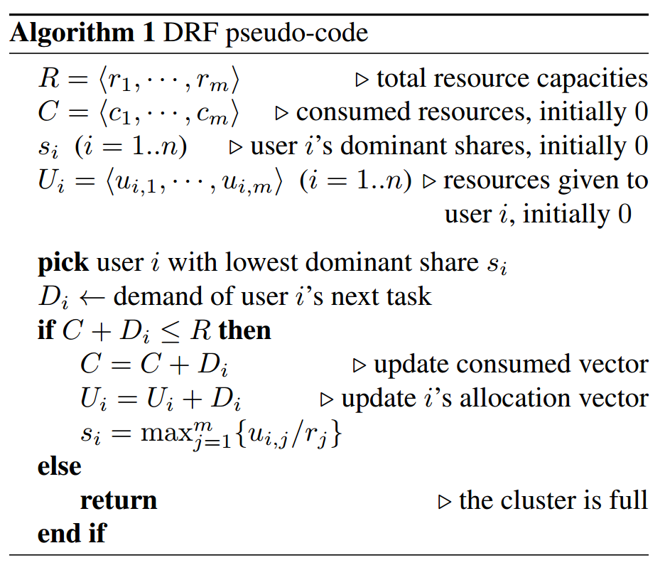
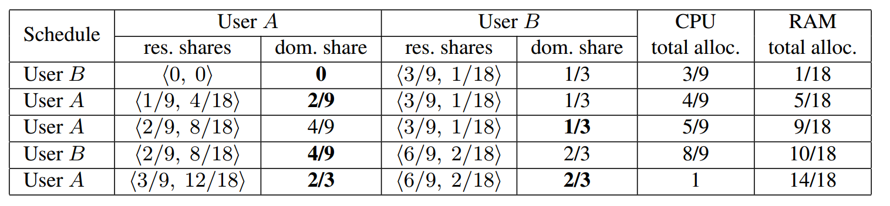

# 作业报告
***
## 1. 用自己的语言描述Mesos的组成结构，指出它们在源码中的具体位置，简单描述一下它们的工作流程

#### Mesos组成架构


上图比较简明扼要地展示了Mesos的主要组成部分。Mesos包括一个*master*守护进程，用来管理运行在各个集群结点上的*agent*守护进程，*Mesos frameworks*在这些agent之上运行各种任务。

master通过*resource offer*在框架间进行资源分配，这种机制使得细粒度的资源共享称为了可能。master会根据现有的分配组织策略（比如均等的分配策略或者有严格优先级的分配策略）来决定对各个框架分别offer多少资源。为了支持多种分配策略，master通过模块化架构和模块插入机制使其较为简单地实现。显然master可能会遇到单点故障的问题，Mesos通过Zookeeper解决该问题。它会维持一些预备的master结点，在当前master出现故障时由预备master通过“选举机制”选出新的master。Zookeeper选举和两个模块有关:contender和detecter,contenter是用来进行master竞选的，而detecter用来发现当前使用的master,其机制图如下:


agent负责接受并执行来自master的命令，管理节点上的task。当agent上存在空闲的资源时，agent将自己的空闲资源量发送给master，再由master的分配。当task运行时，agent会将任务放到包含固定资源的container中运行，以达到资源隔离的效果。

在Mesos之上运行地framework包括两个组成部分：一个scheduler负责向master注册，以及接受或者拒绝master的资源offer；另一个executor运行在agent结点上，执行framework的任务。master决定配给一个framework多少资源，而该framework的scheduler选择到底用哪一个被分配的资源。当一个framework接受资源offer，它会将任务描述发送给Mesos，然后Mesos将这些任务在agent上启动。因此，整个Mesos系统是一个双层调度的框架：第一层由master将资源分配给框架；第二层由框架自己的调度器将资源分配给自己内部的任务。

在源代码中的位置如下
* master: [mesos-1.1.0/src/master](../mesos-1.1.0/mesos-1.1.0/src/master)
* agent(slave): [mesos-1.1.0/src/slave](../mesos-1.1.0/mesos-1.1.0/src/slave)
* framework-scheduler: [mesos-1.1.0/src/scheduler](../mesos-1.1.0/mesos-1.1.0/src/scheduler)
* framework-executer: [mesos-1.1.0/src/executer](../mesos-1.1.0/mesos-1.1.0/src/executer)

#### Mesos运行流程 (Resource offer 的流程)

Mesos的工作，即在不同的计算框架之间细粒度地分配资源（CPU、内存），主要是通过resource offer机制完成的。下图是一个很好的resource offer的例子:


主要经过下面4个步骤:

1. Agent 1 向master报告它有4个CPU和4GB内存可用。于是master启用分配模块，得知framework 1 应该分配所有当前可用的资源。
2. master发送向framework 1 发送resource offer，告诉framework 1 在agent 1 上有哪些可用的资源。
3. framework 1 的scheduler发送信息回应master，描述了将要在agent上运行的两个任务，第一个任务需要2个CPU、1GB内存，第二个任务需要1个CPU、2GB内存。
4. 最终，master将任务发送给agent，并且分配相应的资源给framework的executer，然后executor就在agent上运行那两个任务。因为agnet 1 上还有1个CPU和1GB内存没有被分配，master的分配模块可能将其分配给framework 2.

值得一提的是，当master的资源offer无法满足framework的要求，framework可以拒绝该offer，并且等待直到一个满足要求的offer出现。


## 2. 用自己的语言描述框架（如Spark On Mesos）在Mesos上的运行过程，并与在传统操作系统上运行程序进行对比

在上题中，我主要以Mesos的视角说明了运行流程，本题则要求以框架的视角来说明。这里，我用Spark On Mesos作为例子来说明运行过程。Spark的架构如下图:


当Spark以Standalone模式运行时，中间的Cluster Manager是Spark自己的Standalone Cluster Manager,而运行在Mesos上，Cluster Manager变成了Mesos master来集中管理资源。SparkContext是Spark中用来管理和协调各个Spark进程的对象（在Driver Program中）。它会和master交互，一旦连接上master，Spark就获得了master分配的结点上的executor，executer可以用来为你的程序进行计算或者存储数据。然后SparkContext发送应用程序代码到各个executer结点上，最后发送Task到executer上运行。

结合1、2题，我将在Mesos上运行框架和在传统操作系统上运行程序的相同和不同总结如下：

* **相同：**
  1. Mesos和传统操作系统都向上层应用程序屏蔽抽象了底层硬件，只是提供接口供调用。
  2. 都有隔离机制。框架与框架之间，进程与进程之间一般互不影响，独立运行。

* **不同：**
  1. 底层硬件不同。Mesos管理集群，而传统操作系统针对单机。
  2. 运行的应用程序类型不同。Mesos上运行的程序大多是分布式的、高并行度的，而传统操作系统的应用程序大多是单机的、并行度低甚至是顺序执行的。结构上分布式框架多数需要使用master-slave模型进行控制；单机程序不需要这种模型。
  3. 同步程度和同步机制不同。Mesos运行的框架大多是异步执行任务的，仅仅在几个关键节点进行同步，同步的方法是进程间相互发送信息；而传统操作系统由于只有一个内存，同步变得尤为重要，同步的方法多是使用互斥锁。
  4. Mesos上运行分布式程序需要更多地考虑硬件失效的问题，随着结点数的增加，失效的概率会上升。Mesos专门设计了一套应对单点失效的机制，而传统的操作系统基本无需考虑这个问题。
  5. 对通信和IO的要求不同。Mesos上运行的分布式程序一般需要大量结点与结点间通信，对IO的速度有更大的需求。
  6. 程序与操作人员的交互目前在传统的操作系统上更为多样化。


## 3. 叙述master和slave的初始化过程

#### libprocess

libprocess是Mesos底层的一个基本库，它与Mesos各个部分的实现以及通信息息相关，因为它是整个结构的基础，在这里先简要介绍其作用与思想。

libprocess是基于[actor模型](https://en.wikipedia.org/wiki/Actor_model)实现的。在actor模型中，所有东西都被视为一个actor。actor之间是独立的，它们的交互只能通过相互发送信息，actor可以通过得到的信息作出反应。一般来说，actor可以维护一个消息队列，顺序地接收消息。在libprocess里，类似actor的执行任务的单元叫做process，每一个process有一个独立的ID。process之间只要直到对方ID，就能进行异步通信。

在Mesos的master结点中，每个framework和agent都是一个远程的process。而在agent结点上，每个executer也是一个process。

Mesos里面的消息传递是通过libprocess + protocol buffer来实现的。其流程图如下：


在后台会运行一个且不断监听protocal buffer消息的socket server，获取消息并放入队列中，然后分别分派给不同的功能模块执行。

#### Master

master目录中和初始化流程有关的文件是[main.cpp](../mesos-1.1.0/mesos-1.1.0/src/master/main.cpp)、[master.hpp](../mesos-1.1.0/mesos-1.1.0/src/master/master.hpp)和[master.cpp](../mesos-1.1.0/mesos-1.1.0/src/master/master.cpp)。

在main.cpp中，先记录了一些命令行参数到参数flags中，然后检查参数，并进行了一些配置工作，比如启动日志记录、初始化防火墙等，在一系列配置之后，在最后终于创建了一个master实例:

```
Master* master =
	  new Master(
      	allocator.get(),
      	registrar,
      	&files,
      	contender,
      	detector,
      	authorizer_,
      	slaveRemovalLimiter,
      	flags);
```
创建完后为了还需要将其启动(spawn函数)，并且等待master进程结束(wait函数)。这里的process就是在上文中说到的libprocess中定义的process，而不是简单的进程。
```
process::spawn(master);
process::wait(master->self());
```


在master.hpp中定义了master的基本功能和数据结构，定义在类``class Master : public ProtobufProcess<Master>``中。可见Master继承了类模板ProtobufProcess，后者定义在libprocess中，正如在前面一节所说到的，ProtobufProcess是一个可以不断接受信息的任务单元。

在``private``中我们可以找到master定义的内部属性(很多目前还看不懂....):

* flags:记录了一些命令行参数
* http:一个http路由处理类的实例
* leader:选举出来的当前的master
* allocator:分配模块
* whitelistWatcher:白名单监视器
* registrar:注册器
* files:文件类的实例，实际上是一个从HTTP终端的浏览和读文件的抽象，定义在file/file.hpp中
* contender:竞选模块，用于新master竞选，保证高可用
* detecter:探测模块，用于探测当前master，也是用于保证master的高可用性，可contender一起组成zookeeper竞争机制
* authorizer:授权器，见[官网Authorization说明](http://mesos.apache.org/documentation/latest/authorization/)
* info_:
* machines:一个哈希表，记录了机器的id和机器信息
* slaves:一个结构体，定义了当前master所管理的slave的一些信息
* frameworks:一个结构体，定义了当前master所管理的framework的一些信息
* subscribers:一个结构体，定义了一些终端客户的信息
* recovered:表示完成了恢复。当一个master被选上来就会开始恢复机制
* registryGcTimer:垃圾回收计时器记录，master会周期性地检查这个记录，看何时做垃圾回收
* offers:一个哈希表，记录了offer的id和offer的对应
* offerTimers:一个哈希表，记录了offer的id和计时器的对应
* inverseOffers:一个哈希表，记录offer的id和inverseOffer的对应
* inversOfferTimers:一个哈希表，记录了offerid和计时器的对应
* activeRoles:一个哈希表，记录当前被激活的角色（即该角色存在大于0个框架被注册）,见[官网Roles说明](http://mesos.apache.org/documentation/latest/roles/)
* roleWhitelist:角色白名单
* weight:一个哈希表，记录每个role的权值,见[官网Weights说明](http://mesos.apache.org/documentation/latest/weights/)
* quotas:一个哈希表，记录每个role的配额,见[官网Quota说明](http://mesos.apache.org/documentation/latest/quota/)
* authenticatorNames:flags中传入的认证器的名字
* authenticator:认证器,见[官网Authentication说明](http://mesos.apache.org/documentation/latest/authentication/)
* authenticating:一个哈希表，记录正在认证的frameworks/slaves
* anthenticated:一个哈希表，记录认证过的frameworks/slaves
* nextFrameworkId:用于给每个framework一个唯一的id
* nextOfferId:用于给每个offer一个唯一的id
* nextSlaveId:用于给每个slave一个唯一的id
* metrics:
* startTime:
* electedTime:master被选举上的时间

在master.cpp中和master初始化有关的函数有master的构造函数``Master::Master()``以及一个特殊的初始化函数``Master::initialize()``

先看构造函数：
```
Master::Master(
    Allocator* _allocator,
    Registrar* _registrar,
    Files* _files,
    MasterContender* _contender,
    MasterDetector* _detector,
    const Option<Authorizer*>& _authorizer,
    const Option<shared_ptr<RateLimiter>>& _slaveRemovalLimiter,
    const Flags& _flags)
  : ProcessBase("master"),
    flags(_flags),
    http(this),
    allocator(_allocator),
    registrar(_registrar),
    files(_files),
    contender(_contender),
    detector(_detector),
    authorizer(_authorizer),
    frameworks(flags),
    authenticator(None()),
    metrics(new Metrics(*this)),
    electedTime(None())
```

构造函数直接使用参数初始化列表初始化分配模块、注册器、文件、竞争器、探测器、授权器等。

然后是设置slave的速率限制器，限制的速率是"the removal of slaves failing health checks"???:

```
slaves.limiter = _slaveRemovalLimiter;
```

接下来是设置master的id（随机数），设置ip、端口等，以及设置主机名。

最后又是设置ip、端口? mutable_address什么作用????
```
  // This uses the new `Address` message in `MasterInfo`.
  info_.mutable_address()->set_ip(stringify(self().address.ip));
  info_.mutable_address()->set_port(self().address.port);
  info_.mutable_address()->set_hostname(hostname);
```
接着看函数``Master::initialize()``，其中进行了更多的初始化设置。暂时没发现是在哪调用的这个函数。初始化时执行的各项功能记录如下:

* 380-382：输出日志
* 384-391：检查Master是否绑定在loopback界面上
* 393-464：检查flags中所保存的各项参数
* 466-480：加载credential
* 482-585：认证(authenrization)事宜
* 587-642：设置framework rate limits，见[官网Framework-Rate-Limiting](http://mesos.apache.org/documentation/latest/framework-rate-limiting/)
* 644-693：设置role和role weights
* 695-701：确认timeout > 0
* 704-709：初始化分配器(allocator)
* 711-722：初始化白名单监视器(whitelistWatcher)
* 728：记录启动时间
* 732-843：安装各种消息的处理函数
* 845-1056：设置HTTP路由
* 1058：设置master的pid
* 1060-1062：初始化授权器(authorizer)
* 1064-1082：将日志文件提供给webUI
* 1084：初始化竞争器(contender)
* 1088-1089：竞争器(contender)开始工作，选出leading master
* 1090-1092：探测器(detecter)开始工作，探测当前leader


#### Slave (Agent)

在slave目录中和初始化流程有关的文件是[main.cpp](../mesos-1.1.0/mesos-1.1.0/src/slave/main.cpp)、[slave.hpp](../mesos-1.1.0/mesos-1.1.0/src/slave/slave.hpp)和[slave.cpp](../mesos-1.1.0/mesos-1.1.0/src/slave/slave.cpp)。

在main.cpp中的流程和master中的差不多，同样是记录命令行参数，检查，然后配置，到最后初始化slave对象并启动process:

```
  Slave* slave = new Slave(
      id,
      flags,
      detector,
      containerizer.get(),
      &files,
      &gc,
      &statusUpdateManager,
      resourceEstimator.get(),
      qosController.get(),
      authorizer_);

  process::spawn(slave);
  process::wait(slave->self());
```

在slave.hpp中，slave被定义在``class Slave : public ProtobufProcess<Slave>``中。和master一样，它也是继承了libprocess的ProtobufProcess。其在private中定义的属性如下:

* flags
* http
* info
* checkpointedResources
* totalResources
* master
* frameworks
* completedFrameworks
* detecter
* conteainerizer
* files
* metrics
* startTime
* gc
* statusUpdateManager
* detection
* masterPingTimeout
* pingTimer
* metaDir
* recoveryErrors
* credential
* authenticateeName
* authenticatee
* anthenticating
* authenticated
* reauthenticate
* failedAuthentications
* executorDirectoryMaxAllowedAge
* resourceEstimator
* qosController
* authorizer
* oversubscribedResources

在slave.cpp中也是有两处和初始化有关，一是构造函数``Slave::Slave()``,另一个是初始化函数``Slave::initialize()``


## 4. 查找资料，简述Mesos的资源调度算法，指出在源代码中的具体位置并阅读，说说你对它的看法

Mesos使用的资源调度算法是Dominant Resource Fairness（DRF），相关论文戳[这里](./参考资料/dominant_resourse_fairness_fair_allocation_of_multiple_resource_types.pdf)

Mesos面临的资源调度问题主要是资源的异质性带来的，当你对资源分配的时候，考虑的不是单一的资源，而是需要多种资源（CPU、内存、I/O等）综合考虑。而像Hadoop、Dryad这种框架进行资源分配时就完全忽视了对不同资源需求不同的问题。

DRF算法就是一个解决多种资源分配问题的算法，它的基本思想是从max-min fairness衍生而来的，max-min fairness会想办法最大化分配的最少的资源。而DRF的改进在于，它提出了dominant resource来代表一个用户所分配的资源，并且不断最大化最小的dominant resource。 

DRF算法的关键就是dominant resource和dominant share，dominant resource是指一个用户所分配到的各种类型的资源中，占资源总比例最高的资源，dominant share就是指的这个比例。DRF分配算法的伪代码如下:



在每一个迭代中选取dominant share最少的用户，然后给它分配它下一个task所需的资源，然后重新计算dominant share，直到任一资源不可再分配为止。

下面用一个简单的实例说明这一分配方法:



假设这里有一个有9个CPU和18GB RAM 的系统，有两个用户A和B，A的每一个task需要\<1 CPU, 4GB RAM>，B的每一个task需要\<3CPUs, 1GB RAM>。表中的每一行代表DRF算法进行一次资源分配。首先由于二者的资源都是0，随机选择B，并分配一个task的资源，此时B有3个CPU，占总数的1/3，1GB的RAM，占总数的1/18，因此B的dominant resource时CPU，dominant share是1/3，而此时A的dominant share还是0。由于A 的dominant share小，故这一次分配给A，于是A得到1CPU，4GB RAM，A的dominant resource是RAM，dominant share是2/9。而A的dominant share还是小于B，故下一次分配还是分配给A。如此循环往复，直到CPU资源被分完，不能再分为止。此时A分得\<3CPUs, 12GB RAM>,B分得\<6CPUs, 2GB RAM>，双方得dominant share都是2/3。

Weignted DRF(wDRF)是DRF得一个小变种，它为每个用户得每个使用得资源都分配了一个权重系数，则dominant share需要变为得到资源得比例除以这个系数。如果所有的系数都设为1，那就变为普通的DRF。

## 5. 写一个完成简单工作的框架(语言自选，需要同时实现scheduler和executor)并在Mesos上运行，在报告中对源码进行说明并附上源码，本次作业分数50%在于本项的完成情况、创意与实用程度。（后面的参考资料一定要读，降低大量难度）
