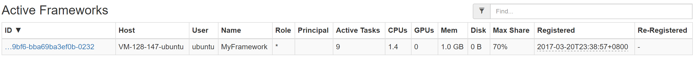
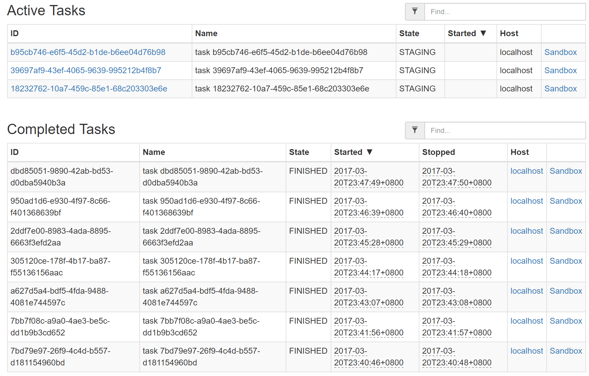
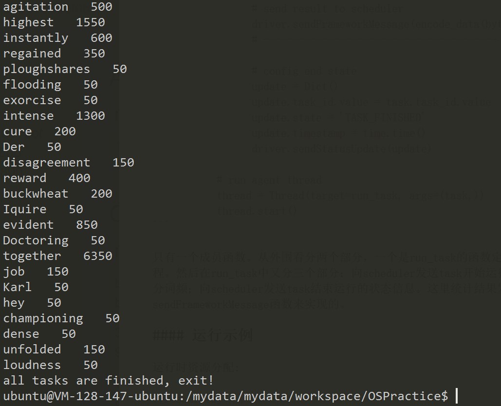

# 作业报告
***
## 1. 用自己的语言描述Mesos的组成结构，指出它们在源码中的具体位置，简单描述一下它们的工作流程

#### Mesos组成架构


上图比较简明扼要地展示了Mesos的主要组成部分。Mesos包括一个*master*守护进程，用来管理运行在各个集群结点上的*agent*守护进程，*Mesos frameworks*在这些agent之上运行各种任务。

master通过*resource offer*在框架间进行资源分配，这种机制使得细粒度的资源共享称为了可能。master会根据现有的分配组织策略（比如均等的分配策略或者有严格优先级的分配策略）来决定对各个框架分别offer多少资源。为了支持多种分配策略，master通过模块化架构和模块插入机制使其较为简单地实现。显然master可能会遇到单点故障的问题，Mesos通过Zookeeper解决该问题。它会维持一些预备的master结点，在当前master出现故障时由预备master通过“选举机制”选出新的master。Zookeeper选举和两个模块有关:contender和detecter,contenter是用来进行master竞选的，而detecter用来发现当前使用的master,其机制图如下:


agent负责接受并执行来自master的命令，管理节点上的task。当agent上存在空闲的资源时，agent将自己的空闲资源量发送给master，再由master的分配。当task运行时，agent会将任务放到包含固定资源的container中运行，以达到资源隔离的效果。

在Mesos之上运行地framework包括两个组成部分：一个scheduler负责向master注册，以及接受或者拒绝master的资源offer；另一个executor运行在agent结点上，执行framework的任务。master决定配给一个framework多少资源，而该framework的scheduler选择到底用哪一个被分配的资源。当一个framework接受资源offer，它会将任务描述发送给Mesos，然后Mesos将这些任务在agent上启动。因此，整个Mesos系统是一个双层调度的框架：第一层由master将资源分配给框架；第二层由框架自己的调度器将资源分配给自己内部的任务。

在源代码中的位置如下
* master: [mesos-1.1.0/src/master](../mesos-1.1.0/mesos-1.1.0/src/master)
* agent(slave): [mesos-1.1.0/src/slave](../mesos-1.1.0/mesos-1.1.0/src/slave)
* framework-scheduler: [mesos-1.1.0/src/scheduler](../mesos-1.1.0/mesos-1.1.0/src/scheduler)
* framework-executer: [mesos-1.1.0/src/executer](../mesos-1.1.0/mesos-1.1.0/src/executer)

#### Mesos运行流程 (Resource offer 的流程)

Mesos的工作，即在不同的计算框架之间细粒度地分配资源（CPU、内存），主要是通过resource offer机制完成的。下图是一个很好的resource offer的例子:


主要经过下面4个步骤:

1. Agent 1 向master报告它有4个CPU和4GB内存可用。于是master启用分配模块，得知framework 1 应该分配所有当前可用的资源。
2. master发送向framework 1 发送resource offer，告诉framework 1 在agent 1 上有哪些可用的资源。
3. framework 1 的scheduler发送信息回应master，描述了将要在agent上运行的两个任务，第一个任务需要2个CPU、1GB内存，第二个任务需要1个CPU、2GB内存。
4. 最终，master将任务发送给agent，并且分配相应的资源给framework的executer，然后executor就在agent上运行那两个任务。因为agnet 1 上还有1个CPU和1GB内存没有被分配，master的分配模块可能将其分配给framework 2.

值得一提的是，当master的资源offer无法满足framework的要求，framework可以拒绝该offer，并且等待直到一个满足要求的offer出现。


## 2. 用自己的语言描述框架（如Spark On Mesos）在Mesos上的运行过程，并与在传统操作系统上运行程序进行对比

在上题中，我主要以Mesos的视角说明了运行流程，本题则要求以框架的视角来说明。这里，我用Spark On Mesos作为例子来说明运行过程。Spark的架构如下图:


当Spark以Standalone模式运行时，中间的Cluster Manager是Spark自己的Standalone Cluster Manager,而运行在Mesos上，Cluster Manager变成了Mesos master来集中管理资源。SparkContext是Spark中用来管理和协调各个Spark进程的对象（在Driver Program中）。它会和master交互，一旦连接上master，Spark就获得了master分配的结点上的executor，executer可以用来为你的程序进行计算或者存储数据。然后SparkContext发送应用程序代码到各个executer结点上，最后发送Task到executer上运行。

结合1、2题，我将在Mesos上运行框架和在传统操作系统上运行程序的相同和不同总结如下：

* **相同：**
  1. Mesos和传统操作系统都向上层应用程序屏蔽抽象了底层硬件，只是提供接口供调用。
  2. 都有隔离机制。框架与框架之间，进程与进程之间一般互不影响，独立运行。

* **不同：**
  1. 底层硬件不同。Mesos管理集群，而传统操作系统针对单机。
  2. 运行的应用程序类型不同。Mesos上运行的程序大多是分布式的、高并行度的，而传统操作系统的应用程序大多是单机的、并行度低甚至是顺序执行的。结构上分布式框架多数需要使用master-slave模型进行控制；单机程序不需要这种模型。
  3. 同步程度和同步机制不同。Mesos运行的框架大多是异步执行任务的，仅仅在几个关键节点进行同步，同步的方法是进程间相互发送信息；而传统操作系统由于只有一个内存，同步变得尤为重要，同步的方法多是使用互斥锁。
  4. Mesos上运行分布式程序需要更多地考虑硬件失效的问题，随着结点数的增加，失效的概率会上升。Mesos专门设计了一套应对单点失效的机制，而传统的操作系统基本无需考虑这个问题。
  5. 对通信和IO的要求不同。Mesos上运行的分布式程序一般需要大量结点与结点间通信，对IO的速度有更大的需求。
  6. 程序与操作人员的交互目前在传统的操作系统上更为多样化。


## 3. 叙述master和slave的初始化过程

#### libprocess

libprocess是Mesos底层的一个基本库，它与Mesos各个部分的实现以及通信息息相关，因为它是整个结构的基础，在这里先简要介绍其作用与思想。

libprocess是基于[actor模型](https://en.wikipedia.org/wiki/Actor_model)实现的。在actor模型中，所有东西都被视为一个actor。actor之间是独立的，它们的交互只能通过相互发送信息，actor可以通过得到的信息作出反应。一般来说，actor可以维护一个消息队列，顺序地接收消息。在libprocess里，类似actor的执行任务的单元叫做process，每一个process有一个独立的ID。process之间只要直到对方ID，就能进行异步通信。

在Mesos的master结点中，每个framework和agent都是一个远程的process。而在agent结点上，每个executer也是一个process。

Mesos里面的消息传递是通过libprocess + protocol buffer来实现的。其流程图如下：


在后台会运行一个且不断监听protocal buffer消息的socket server，获取消息并放入队列中，然后分别分派给不同的功能模块执行。

#### Master

master目录中和初始化流程有关的文件是[main.cpp](../mesos-1.1.0/mesos-1.1.0/src/master/main.cpp)、[master.hpp](../mesos-1.1.0/mesos-1.1.0/src/master/master.hpp)和[master.cpp](../mesos-1.1.0/mesos-1.1.0/src/master/master.cpp)。

在main.cpp中，先记录了一些命令行参数到参数flags中，然后检查参数，并进行了一些配置工作，比如启动日志记录、初始化防火墙等，在一系列配置之后，在最后终于创建了一个master实例:

```
Master* master =
    new Master(
        allocator.get(),
        registrar,
        &files,
        contender,
        detector,
        authorizer_,
        slaveRemovalLimiter,
        flags);
```
创建完后为了还需要将其启动(spawn函数)，并且等待master进程结束(wait函数)。这里的process就是在上文中说到的libprocess中定义的process，而不是简单的进程。
```
process::spawn(master);
process::wait(master->self());
```


在master.hpp中定义了master的基本功能和数据结构，定义在类``class Master : public ProtobufProcess<Master>``中。可见Master继承了类模板ProtobufProcess，后者定义在libprocess中，正如在前面一节所说到的，ProtobufProcess是一个可以不断接受信息的任务单元。

在``private``中我们可以找到master定义的内部属性(很多目前还看不懂....):

* flags:记录了一些命令行参数
* http:一个http路由处理类的实例
* leader:选举出来的当前的master
* allocator:分配模块
* whitelistWatcher:白名单监视器
* registrar:注册器
* files:文件类的实例，实际上是一个从HTTP终端的浏览和读文件的抽象，定义在file/file.hpp中
* contender:竞选模块，用于新master竞选，保证高可用
* detecter:探测模块，用于探测当前master，也是用于保证master的高可用性，可contender一起组成zookeeper竞争机制
* authorizer:授权器，见[官网Authorization说明](http://mesos.apache.org/documentation/latest/authorization/)
* info_:
* machines:一个哈希表，记录了机器的id和机器信息
* slaves:一个结构体，定义了当前master所管理的slave的一些信息
* frameworks:一个结构体，定义了当前master所管理的framework的一些信息
* subscribers:一个结构体，定义了一些终端客户的信息
* recovered:表示完成了恢复。当一个master被选上来就会开始恢复机制
* registryGcTimer:垃圾回收计时器记录，master会周期性地检查这个记录，看何时做垃圾回收
* offers:一个哈希表，记录了offer的id和offer的对应
* offerTimers:一个哈希表，记录了offer的id和计时器的对应
* inverseOffers:一个哈希表，记录offer的id和inverseOffer的对应
* inversOfferTimers:一个哈希表，记录了offerid和计时器的对应
* activeRoles:一个哈希表，记录当前被激活的角色（即该角色存在大于0个框架被注册）,见[官网Roles说明](http://mesos.apache.org/documentation/latest/roles/)
* roleWhitelist:角色白名单
* weight:一个哈希表，记录每个role的权值,见[官网Weights说明](http://mesos.apache.org/documentation/latest/weights/)
* quotas:一个哈希表，记录每个role的配额,见[官网Quota说明](http://mesos.apache.org/documentation/latest/quota/)
* authenticatorNames:flags中传入的认证器的名字
* authenticator:认证器,见[官网Authentication说明](http://mesos.apache.org/documentation/latest/authentication/)
* authenticating:一个哈希表，记录正在认证的frameworks/slaves
* anthenticated:一个哈希表，记录认证过的frameworks/slaves
* nextFrameworkId:用于给每个framework一个唯一的id
* nextOfferId:用于给每个offer一个唯一的id
* nextSlaveId:用于给每个slave一个唯一的id
* metrics:
* startTime:
* electedTime:master被选举上的时间

在master.cpp中和master初始化有关的函数有master的构造函数``Master::Master()``以及一个特殊的初始化函数``Master::initialize()``

先看构造函数：
```
Master::Master(
    Allocator* _allocator,
    Registrar* _registrar,
    Files* _files,
    MasterContender* _contender,
    MasterDetector* _detector,
    const Option<Authorizer*>& _authorizer,
    const Option<shared_ptr<RateLimiter>>& _slaveRemovalLimiter,
    const Flags& _flags)
  : ProcessBase("master"),
    flags(_flags),
    http(this),
    allocator(_allocator),
    registrar(_registrar),
    files(_files),
    contender(_contender),
    detector(_detector),
    authorizer(_authorizer),
    frameworks(flags),
    authenticator(None()),
    metrics(new Metrics(*this)),
    electedTime(None())
```

构造函数直接使用参数初始化列表初始化分配模块、注册器、文件、竞争器、探测器、授权器等。

然后是设置slave的速率限制器，限制的速率是"the removal of slaves failing health checks"???:

```
slaves.limiter = _slaveRemovalLimiter;
```

接下来是设置master的id（随机数），设置ip、端口等，以及设置主机名。

最后又是设置ip、端口? mutable_address什么作用????
```
  // This uses the new `Address` message in `MasterInfo`.
  info_.mutable_address()->set_ip(stringify(self().address.ip));
  info_.mutable_address()->set_port(self().address.port);
  info_.mutable_address()->set_hostname(hostname);
```
接着看函数``Master::initialize()``，其中进行了更多的初始化设置。暂时没发现是在哪调用的这个函数。初始化时执行的各项功能记录如下:

* 380-382：输出日志
* 384-391：检查Master是否绑定在loopback界面上
* 393-464：检查flags中所保存的各项参数
* 466-480：加载credential
* 482-585：认证(authenrization)事宜
* 587-642：设置framework rate limits，见[官网Framework-Rate-Limiting](http://mesos.apache.org/documentation/latest/framework-rate-limiting/)
* 644-693：设置role和role weights
* 695-701：确认timeout > 0
* 704-709：初始化分配器(allocator)
* 711-722：初始化白名单监视器(whitelistWatcher)
* 728：记录启动时间
* 732-843：安装各种消息的处理函数
* 845-1056：设置HTTP路由
* 1058：设置master的pid
* 1060-1062：初始化授权器(authorizer)
* 1064-1082：将日志文件提供给webUI
* 1084：初始化竞争器(contender)
* 1088-1089：竞争器(contender)开始工作，选出leading master
* 1090-1092：探测器(detecter)开始工作，探测当前leader


#### Slave (Agent)

在slave目录中和初始化流程有关的文件是[main.cpp](../mesos-1.1.0/mesos-1.1.0/src/slave/main.cpp)、[slave.hpp](../mesos-1.1.0/mesos-1.1.0/src/slave/slave.hpp)和[slave.cpp](../mesos-1.1.0/mesos-1.1.0/src/slave/slave.cpp)。

在main.cpp中的流程和master中的差不多，同样是记录命令行参数，检查，然后配置，到最后初始化slave对象并启动process:

```
  Slave* slave = new Slave(
      id,
      flags,
      detector,
      containerizer.get(),
      &files,
      &gc,
      &statusUpdateManager,
      resourceEstimator.get(),
      qosController.get(),
      authorizer_);

  process::spawn(slave);
  process::wait(slave->self());
```

在slave.hpp中，slave被定义在``class Slave : public ProtobufProcess<Slave>``中。和master一样，它也是继承了libprocess的ProtobufProcess。其在private中定义的属性如下:

* flags：记录了一些命令行参数
* http：http路由处理程序
* info：记录了一些基本信息
* checkpointedResources：被slave checkpoint过的资源?????
* totalResources：agent当前的所有资源
* master：对应的master
* frameworks：一个哈希表，记录了framework的id和对应的framework
* completedFrameworks：已完成的任务
* detecter：检测器，用于检测当前master
* conteainerizer：竞争器，用于在master候选中选出leader master
* files：文件
* metrics：
* startTime：运行起始时间
* gc：垃圾收集器
* statusUpdateManager：状态更新管理器
* detection：也是用于master detection，和detector有什么区别？？？
* masterPingTimeout：master ping超时的值，在重新注册时更新
* pingTimer：计时器，当没有受到来自master的ping的时候触发
* metaDir：装有checkpoint数据的目录的根目录
* recoveryErrors：表示在"--no-strict"recovery模式中忽略的错误号
* credential：
* authenticateeName：通过命令行参数传进来的被认证者的名字
* authenticatee：被认证者
* anthenticating：表示是否有一个认证过程正在进行
* authenticated：表示认证是否成功
* reauthenticate：表示一个新的认证过程是否需要执行
* failedAuthentications：表示认证失败的次数
* executorDirectoryMaxAllowedAge：executor目录的最大存在时间
* resourceEstimator：资源估计器
* qosController
* authorizer：授权者
* oversubscribedResources：对于多分配的资源的最新的估计

在slave.cpp中也是有两处和初始化有关，一是构造函数``Slave::Slave()``,另一个是初始化函数``Slave::initialize()``

在构造函数中，Slave直接用初始化列表初始化了id、认证、授权等一系列属性：
```
Slave::Slave(const string& id,
             const slave::Flags& _flags,
             MasterDetector* _detector,
             Containerizer* _containerizer,
             Files* _files,
             GarbageCollector* _gc,
             StatusUpdateManager* _statusUpdateManager,
             ResourceEstimator* _resourceEstimator,
             QoSController* _qosController,
             const Option<Authorizer*>& _authorizer)
  : ProcessBase(id),
    state(RECOVERING),
    flags(_flags),
    http(this),
    completedFrameworks(MAX_COMPLETED_FRAMEWORKS),
    detector(_detector),
    containerizer(_containerizer),
    files(_files),
    metrics(*this),
    gc(_gc),
    statusUpdateManager(_statusUpdateManager),
    masterPingTimeout(DEFAULT_MASTER_PING_TIMEOUT()),
    metaDir(paths::getMetaRootDir(flags.work_dir)),
    recoveryErrors(0),
    credential(None()),
    authenticatee(nullptr),
    authenticating(None()),
    authenticated(false),
    reauthenticate(false),
    failedAuthentications(0),
    executorDirectoryMaxAllowedAge(age(0)),
    resourceEstimator(_resourceEstimator),
    qosController(_qosController),
    authorizer(_authorizer) {}
```

函数``Slave::initialize()``初始化的情况如下:

* 208-209：输出日志
* 211-218：检查slave是否绑定在loopback界面上
* 220-323：对每一个子系统，将slave移动到它的cgroup之下  cgroup是什么???
* 325-330：检查registration_backoff_factor 什么用？？？
* 334-386：处理认证相关信息
* 388-382：检查gc_disk_headroom
* 394-400：初始化resourceEstimater
* 402-407：初始化qosController
* 409-411：检查slave工作目录是否存在
* 413-417：初始化resources
* 419-491：确认所有磁盘上的源？？（source）可用
* 493-496：初始化属性（attributes）
* 498-517：初始化hostname
* 519-527：初始化slave的信息（info）
* 529-539：通过info.resources初始化totalResources
* 543-544：enable checkpointing of slaves
* 546：输出日志：agent hostname
* 548-549：初始化状态更新管理器(statusUpdateMananger)
* 551-555：启动磁盘监视
* 557：记录启动时间
* 559-649：安装protobuf处理函数
* 652-724：设置HTTP路由
* 726：设置pid
* 728-733：设置认证
* 735-753：将日志文件提供给webUI
* 755-760：检查recover标志是否有效
* 762-775：安装信号处理函数
* 777-781：做recovery


## 4. 查找资料，简述Mesos的资源调度算法，指出在源代码中的具体位置并阅读，说说你对它的看法

#### DRF算法概述

Mesos使用的资源调度算法是Dominant Resource Fairness（DRF），相关论文戳[这里](./参考资料/dominant_resourse_fairness_fair_allocation_of_multiple_resource_types.pdf)

Mesos面临的资源调度问题主要是资源的异质性带来的，当你对资源分配的时候，考虑的不是单一的资源，而是需要多种资源（CPU、内存、I/O等）综合考虑。而像Hadoop、Dryad这种框架进行资源分配时就完全忽视了对不同资源需求不同的问题。

DRF算法就是一个解决多种资源分配问题的算法，它的基本思想是从max-min fairness衍生而来的，max-min fairness会想办法最大化分配的最少的资源。而DRF的改进在于，它提出了dominant resource来代表一个用户所分配的资源，并且不断最大化最小的dominant resource。 

DRF算法的关键就是dominant resource和dominant share，dominant resource是指一个用户所分配到的各种类型的资源中，占资源总比例最高的资源，dominant share就是指的这个比例。DRF分配算法的伪代码如下:


在每一个迭代中选取dominant share最少的用户，然后给它分配它下一个task所需的资源，然后重新计算dominant share，直到任一资源不可再分配为止。

下面用一个简单的实例说明这一分配方法:


假设这里有一个有9个CPU和18GB RAM 的系统，有两个用户A和B，A的每一个task需要\<1 CPU, 4GB RAM>，B的每一个task需要\<3CPUs, 1GB RAM>。表中的每一行代表DRF算法进行一次资源分配。首先由于二者的资源都是0，随机选择B，并分配一个task的资源，此时B有3个CPU，占总数的1/3，1GB的RAM，占总数的1/18，因此B的dominant resource时CPU，dominant share是1/3，而此时A的dominant share还是0。由于A 的dominant share小，故这一次分配给A，于是A得到1CPU，4GB RAM，A的dominant resource是RAM，dominant share是2/9。而A的dominant share还是小于B，故下一次分配还是分配给A。如此循环往复，直到CPU资源被分完，不能再分为止。此时A分得\<3CPUs, 12GB RAM>,B分得\<6CPUs, 2GB RAM>，双方得dominant share都是2/3。

Weignted DRF(wDRF)是DRF得一个小变种，它为每个用户得每个使用得资源都分配了一个权重系数，则dominant share需要变为得到资源得比例除以这个系数。如果所有的系数都设为1，那就变为普通的DRF。

#### 源码

mesos分配的源码在目录[src/master/allocator](../mesos-1.1.0/mesos-1.1.0/src/master/allocator)中，默认的分配器是HierarchicalAllocator,其定义在[src/master/allocator/mesos/hierarchical.hpp](../mesos-1.1.0/mesos-1.1.0/src/master/allocator/mesos/hierarchical.hpp)和[src/master/allocator/mesos/hierarchical.cpp](../mesos-1.1.0/mesos-1.1.0/src/master/allocator/mesos/hierarchical.cpp)中。

DRF算法的源码在目录[src/master/allocator/sorter/drf](../mesos-1.1.0/mesos-1.1.0/src/master/allocator/sorter/drf)中，主要在[sorter.hpp](../mesos-1.1.0/mesos-1.1.0/src/master/allocator/sorter/drf/sorter.hpp)和[sorter.cpp](../mesos-1.1.0/mesos-1.1.0/src/master/allocator/sorter/drf/sorter.cpp)两个源文件中。我先从底层DRF算法介绍

###### sorter.hpp、sorter.cpp

sorter.hpp中定义了两个结构体，一个类。

Client结构封装了Client类，一个Client可能是一个user或者framework，加上了一个share变量表示该用户分配的份额，变量allocations记录了该用户被算法选中分配的次数:
```
struct Client
{
  Client(const std::string& _name, double _share, uint64_t _allocations)
    : name(_name), share(_share), allocations(_allocations) {}

  std::string name;
  double share;

  // We store the number of times this client has been chosen for
  // allocation so that we can fairly share the resources across
  // clients that have the same share. Note that this information is
  // not persisted across master failovers, but since the point is to
  // equalize the 'allocations' across clients of the same 'share'
  // having allocations restart at 0 after a master failover should be
  // sufficient (famous last words.)
  uint64_t allocations;
};
```

DRFComparator结构封装了一个括号运算符，实际是一个比较器，对两个用户进行比较，比较的优先级顺序是share、allocations、name:
```
struct DRFComparator
{
  virtual ~DRFComparator() {}
  virtual bool operator()(const Client& client1, const Client& client2);
};
```

DRFSorter类是主要功能类，也是Sorter类的子类，后者在[/src/master/allocator/sorter/sorter.hpp](../mesos-1.1.0/mesos-1.1.0/src/master/allocator/sorter/worter.hpp)中定义，主要包括了一些维护client和resource集合的虚函数，比如add、remove、update等，以及client的排序函数sort。

DRFSorter类中``private``包括的属性有:

* fairnessExcludeResourceNames：不参与分配的资源
* clients：client集合，是一个c++的set结构（实际底层是一个红黑树，将自动排序），比较器是之前提到的DRFComparator
* weights：一个哈希表，指定了每个client的权值
* total_：一个结构体，封装了所有资源
* allocations：一个哈希表，指定了每个client被分配的资源


sorter.cpp文件是上述sorter.hpp中函数的具体实现。

###### hierarchical.hpp、hierarchical.cpp

从文件名上看即可以知道这个分配器是一个层次化的分配器，主要类是``HierarchicalAllocatorProcess``，定义在hierarchical.hpp中。该分配器的分配过程包括两个stage：

* 第一个stage资源仅仅分配给有配额（quota）的角色（role）的framework
* 第二个stage剩下的资源不要求满足剩余未分配的配额，因此可以分配给所有的framework

而每一个stage又分为另个level：

* Level 1：根据角色排序
* Level 2：在每个特定角色中根据framework排序

构造函数如下:
```
  HierarchicalAllocatorProcess(
      const std::function<Sorter*()>& roleSorterFactory,
      const std::function<Sorter*()>& _frameworkSorterFactory,
      const std::function<Sorter*()>& quotaRoleSorterFactory)
    : initialized(false),
      paused(true),
      metrics(*this),
      roleSorter(roleSorterFactory()),
      quotaRoleSorter(quotaRoleSorterFactory()),
      frameworkSorterFactory(_frameworkSorterFactory) {}
```
其中初始化了三个DRFSorter，role、quota和framework分别对应针对角色的sorter，针对有配额角色的sorter以及每一个role都有一个的针对framework的sorter，通过不同的sorter可以满足层次化的需求。

分配的过程主要在``HierarchicalAllocatorProcess::updateAllocation()``函数中，代码如下：
```
void HierarchicalAllocatorProcess::updateAllocation(
    const FrameworkID& frameworkId,
    const SlaveID& slaveId,
    const Resources& offeredResources,
    const vector<Offer::Operation>& operations)
{
  CHECK(initialized);
  CHECK(slaves.contains(slaveId));
  CHECK(frameworks.contains(frameworkId));

  const string& role = frameworks[frameworkId].role;
  CHECK(frameworkSorters.contains(role));

  const Owned<Sorter>& frameworkSorter = frameworkSorters[role];

  // We keep a copy of the offered resources here and it is updated
  // by the operations.
  Resources _offeredResources = offeredResources;

  foreach (const Offer::Operation& operation, operations) {
    Try<Resources> updatedOfferedResources = _offeredResources.apply(operation);
    CHECK_SOME(updatedOfferedResources);
    _offeredResources = updatedOfferedResources.get();

    if (operation.type() == Offer::Operation::LAUNCH) {
      // Additional allocation needed for the operation.
      //
      // For LAUNCH operations we support tasks requesting more
      // instances of shared resources than those being offered. We
      // keep track of these additional instances and allocate them
      // as part of updating the framework's allocation (i.e., add
      // them to the allocated resources in the allocator and in each
      // of the sorters).
      Resources additional;

      hashset<TaskID> taskIds;

      foreach (const TaskInfo& task, operation.launch().task_infos()) {
        taskIds.insert(task.task_id());

        // For now we only need to look at the task resources and
        // ignore the executor resources.
        //
        // TODO(anindya_sinha): For simplicity we currently don't
        // allow shared resources in ExecutorInfo. The reason is that
        // the allocator has no idea if the executor within the task
        // represents a new executor. Therefore we cannot reliably
        // determine if the executor resources are needed for this task.
        // The TODO is to support it. We need to pass in the information
        // pertaining to the executor before enabling shared resources
        // in the executor.
        const Resources& consumed = task.resources();
        additional += consumed.shared() - _offeredResources.shared();

        // (Non-shared) executor resources are not removed from
        // _offeredResources but it's OK because we only care about
        // shared resources in this variable.
        _offeredResources -= consumed;
      }

      if (!additional.empty()) {
        LOG(INFO) << "Allocating additional resources " << additional
                  << " for tasks " << stringify(taskIds);

        CHECK_EQ(additional.shared(), additional);

        const Resources frameworkAllocation =
          frameworkSorter->allocation(frameworkId.value(), slaveId);

        foreach (const Resource& resource, additional) {
          CHECK(frameworkAllocation.contains(resource));
        }

        // Allocate these additional resources to this framework. Because
        // they are merely additional instances of the same shared
        // resources already allocated to the framework (validated by the
        // master, see the CHECK above), this doesn't have an impact on
        // the allocator's allocation algorithm.
        slaves[slaveId].allocated += additional;

        frameworkSorter->add(slaveId, additional);
        frameworkSorter->allocated(frameworkId.value(), slaveId, additional);
        roleSorter->allocated(role, slaveId, additional);

        if (quotas.contains(role)) {
          quotaRoleSorter->allocated(
              role, slaveId, additional.nonRevocable());
        }
      }

      continue;
    }

    // Here we apply offer operations to the allocated and total
    // resources in the allocator and each of the sorters. The available
    // resource quantities remain unchanged.

    // Update the per-slave allocation.
    Try<Resources> updatedSlaveAllocation =
      slaves[slaveId].allocated.apply(operation);

    CHECK_SOME(updatedSlaveAllocation);

    slaves[slaveId].allocated = updatedSlaveAllocation.get();

    // Update the total resources.
    Try<Resources> updatedTotal = slaves[slaveId].total.apply(operation);
    CHECK_SOME(updatedTotal);

    slaves[slaveId].total = updatedTotal.get();

    // Update the total and allocated resources in each sorter.
    Resources frameworkAllocation =
      frameworkSorter->allocation(frameworkId.value(), slaveId);

    Try<Resources> updatedFrameworkAllocation =
      frameworkAllocation.apply(operation);

    CHECK_SOME(updatedFrameworkAllocation);

    // Update the total and allocated resources in the framework sorter
    // for the current role.
    frameworkSorter->remove(slaveId, frameworkAllocation);
    frameworkSorter->add(slaveId, updatedFrameworkAllocation.get());

    frameworkSorter->update(
        frameworkId.value(),
        slaveId,
        frameworkAllocation,
        updatedFrameworkAllocation.get());

    // Update the total and allocated resources in the role sorter.
    roleSorter->remove(slaveId, frameworkAllocation);
    roleSorter->add(slaveId, updatedFrameworkAllocation.get());

    roleSorter->update(
        role,
        slaveId,
        frameworkAllocation,
        updatedFrameworkAllocation.get());

    // Update the total and allocated resources in the quota role
    // sorter. Note that we always update the quota role sorter's total
    // resources; we only update its allocated resources if this role
    // has quota set.
    quotaRoleSorter->remove(slaveId, frameworkAllocation.nonRevocable());
    quotaRoleSorter->add(
        slaveId, updatedFrameworkAllocation.get().nonRevocable());

    if (quotas.contains(role)) {
      // See comment at `quotaRoleSorter` declaration regarding non-revocable.
      quotaRoleSorter->update(
          role,
          slaveId,
          frameworkAllocation.nonRevocable(),
          updatedFrameworkAllocation.get().nonRevocable());
    }

    LOG(INFO) << "Updated allocation of framework " << frameworkId
              << " on agent " << slaveId
              << " from " << frameworkAllocation
              << " to " << updatedFrameworkAllocation.get() << " with "
              << operation.Type_Name(operation.type()) << " operation";
  }
}

```


## 5. 写一个完成简单工作的框架(语言自选，需要同时实现scheduler和executor)并在Mesos上运行，在报告中对源码进行说明并附上源码，本次作业分数50%在于本项的完成情况、创意与实用程度。（后面的参考资料一定要读，降低大量难度）

因为我对python比较熟悉，因此选用了[PyMesos](https://github.com/douban/pymesos)，这是Mesos HTTP API的python语言封装，由国内豆瓣公司完成。

然而比较麻烦的一点是并没有文档和说明，在很多层面都造成了不少的麻烦。

我基于PyMesos实现了一个比较简单的框架，可以完成简单的word count的功能，当然性能上感觉比起Spark还是差不少。框架改编自PyMesos自带的[example](./pymesos/examples)，example仅仅架起来了一个scheduler不断向executor分配task的框架。我将其功能扩展了，总共包括三个文件:

* [my_wordcount.py](./my_wordcount.py):包括main函数，程序启动的入口。
* [my_scheduler.py](./my_scheduler.py):包括scheduler的类定义，和一个读取文件的函数
* [my_executor.py](./my_executor.py):包括executor的类定义

#### my_wordcount.py

主要步骤如下：
```
    # init driver
    driver = MesosSchedulerDriver(
        MyScheduler(executor),
        framework,
        master,
        use_addict=True,
    )

    # set Ctrl+C handler, stop the driver
    def signal_handler(signal, frame):
        driver.stop()

    # run driver
    def run_driver_thread():
        driver.run()

    # init scheduler thread and run
    driver_thread = Thread(target=run_driver_thread, args=())
    driver_thread.start()

    # Ctrl+C => stop
    ('Scheduler running, Ctrl+C to quit.')
    signal.signal(signal.SIGINT, signal_handler)

    # keep alive
    while driver_thread.is_alive():
        time.sleep(1)
```
先是初始化scheduler驱动，这个驱动继承了Process，总的来说就是管理scheduler底层的、和进程、通信相关的事物。MyScheduler是我在my_scheduler.py中定义的scheduler类，executer和framework实际上都是一些json数据，是之前配置好executor和framework的参数，比如executor的id、占用资源，framework的名字、主机名等，还有一个重要的配置是executor的源代码文件存放位置（这一点很奇怪貌似PyMesos是通过这个运行executor的，暂时没有去看具体机制）。master是在命令行中输入的ip地址，是Mesos Master的地址。

接下来是设置Ctrl+C退出以及运行该进程。

最后让scheduler一直跑（退出在后面会提到，我觉得我这里做得还不够简洁美观）。

#### my_scheduler.py

scheduler的类定义如下：
```
class MyScheduler(Scheduler):

    def __init__(self, executor):
        # executor
        self.executor = executor
        # some flags
        self.task_launched = 0
        self.task_finished = 0
        self.task_merged = 0
        # data
        self.datas = readData()
        self.word_count = {}

    # print out the counted words
    def printWordCount(self):
        for word, num in self.word_count.items():
            print(word, ' ', num)

    # invoked when resources have been offered to this framework
    def resourceOffers(self, driver, offers):
        filters = {'refuse_seconds': 5}

        # if all tasks have been launched, return directly 
        if self.task_launched == TASK_NUM:
            return 

        # for every offer
        for offer in offers:
            # check if the offer satisfy the requirments
            cpus = self.getResource(offer.resources, 'cpus')
            mem = self.getResource(offer.resources, 'mem')
            if cpus < TASK_CPU or mem < TASK_MEM:
                continue

            # config a new task
            task = Dict()
            task_id = str(uuid.uuid4())
            task.task_id.value = task_id
            task.agent_id.value = offer.agent_id.value
            task.name = 'task {}'.format(task_id)
            task.executor = self.executor
            #task.data = encode_data(bytes('Hello from task {}!'.format(task_id), 'utf-8'))
            task.data = encode_data(bytes('ThisIsASeparator'.join(self.datas[self.task_launched]), 'utf-8'))

            task.resources = [
                dict(name='cpus', type='SCALAR', scalar={'value': TASK_CPU}),
                dict(name='mem', type='SCALAR', scalar={'value': TASK_MEM}),
            ]

            # launch task
            driver.launchTasks(offer.id, [task], filters)

            self.task_launched += 1

    # receive task result
    def frameworkMessage(self, driver, executorId, slaveId, message):
        # merge task result
        result = decode_data(message).decode().split('ThisIsAnOuterSeparator')
        for item in result:
            item = item.split('ThisIsAnInnerSeparator')
            if item[0] in self.word_count:
                self.word_count[item[0]] += int(item[1])
            else:
                self.word_count[item[0]] = int(item[1])
        self.task_merged += 1

    def getResource(self, res, name):
        for r in res:
            if r.name == name:
                return r.scalar.value
        return 0.0

    # invoked when the status of a task has changed
    # eg: executorDriver call sendStateUpdate()
    def statusUpdate(self, driver, update):
        # log
        logging.debug('Status update TID %s %s',
                      update.task_id.value,
                      update.state)

        # check if task finished
        if update.state == 'TASK_FINISHED':
            self.task_finished += 1
            # check if all tasks are finished
            if self.task_finished == TASK_NUM and self.task_merged == TASK_NUM:
                self.printWordCount()
                print('all tasks are finished, exit!')
                exit(0)
```
在初始化时设置了几个标志位，scheduler的控制基本是靠这几个标志位实现的。以及直接读取了数据，还有为结果创建了数据结构。

resourceOffers是主要的接收资源offer和运行task的函数。首先判断，若已经运行的task和期望的task数量已经相等，既不接收资源也不运行新task，直接返回。然后对每一个offer，检查offer的资源是否满足一个task的需求，不满足直接跳过。然后就是创建一个新task，并且在offer给定的硬件上运行task。刷新计数。

frameworkMessage函数接收从executor发送的执行结果，一旦收到executor的信息，该函数就会启动。主要功能是合并task结果到本地的结果数据中。

另外，整个程序的出口在statusUpdate中，一旦发现指定数量的task都完成，并且合并也完成了，输出所有结果，然后退出。

对每个task的资源分配，可以通过全局变量来进行设置。

#### my_executor.py

类定义如下：
```
class MyExecutor(Executor):

    def launchTask(self, driver, task):
        def run_task(task):
            # config start state
            update = Dict()
            update.task_id.value = task.task_id.value
            update.state = 'TASK_RUNNING'
            update.timestamp = time.time()
            driver.sendStatusUpdate(update)


            # word count
            # ----------------------------------------
            # data preparation
            words = decode_data(task.data).decode().split('ThisIsASeparator')
            
            # count words 
            word_count = {}
            for word in words:
                if word in word_count:
                    word_count[word] += 1
                else:
                    word_count[word] = 1

            # prepare result
            result = []
            for word, cnt in word_count.items():
                result.append(word+'ThisIsAnInnerSeparator'+str(cnt))           
            result = 'ThisIsAnOuterSeparator'.join(result)       

            # send result to scheduler
            driver.sendFrameworkMessage(encode_data(bytes(result, 'utf-8')))
            # ----------------------------------------
            
            # config end state
            update = Dict()
            update.task_id.value = task.task_id.value
            update.state = 'TASK_FINISHED'
            update.timestamp = time.time()
            driver.sendStatusUpdate(update)

        # run agent thread
        thread = Thread(target=run_task, args=(task,))
        thread.start()
```

只有一个成员函数。从外围看分两个部分，一个是run_task的函数定义，另一个是启动这个线程。然后在run_task中又分三个部分：向scheduler发送task开始运行的状态信息；统计该部分词频；向scheduler发送task结束运行的状态信息。这里统计结果发送是通过sendFrameworkMessage函数来实现的。

#### 运行示例

运行时资源分配:



运行时Task状态:



运行结果示例:



使用的数据是安娜卡列尼娜英文版复制50次（约90M）

#### 存在的问题

1. 第一个问题是程序结构上的问题，一开始希望做成scheduler和executor可以做成通用接口，随时写一个任意的程序就能在框架上跑的。但是限于自己水平的不足和对PyMesos的不了解暂时只能把业务逻辑和框架紧紧绑定在一起。
2. 数据切分以及Task数量的确定以及资源的分配还是非常愚蠢的人工设置方式，无法做到Spark那样随分配的资源自动完成。并且在一些设置下，task的并行度根本提不上来，有时候还是一个一个运行的。
3. 无法处理较大的数据，这可能和数据读取方式以及前面的人工设置资源分配有关。在Spark上能跑900M的数据，这边完全不行。
4. 速度慢。有的时候由于task一个一个跑，大部分时间花在了业务逻辑以外的地方。


