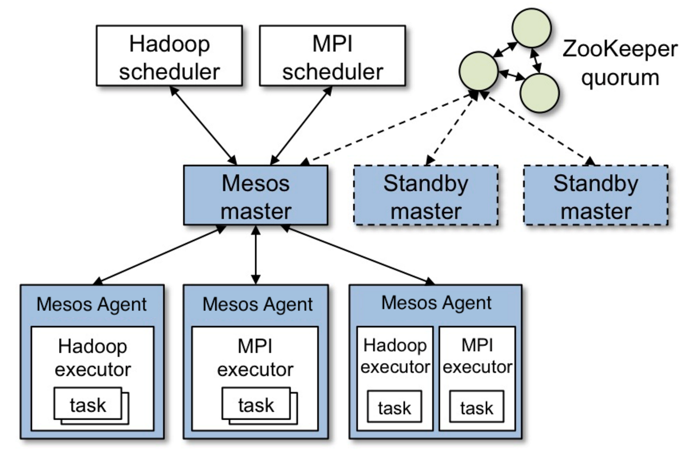
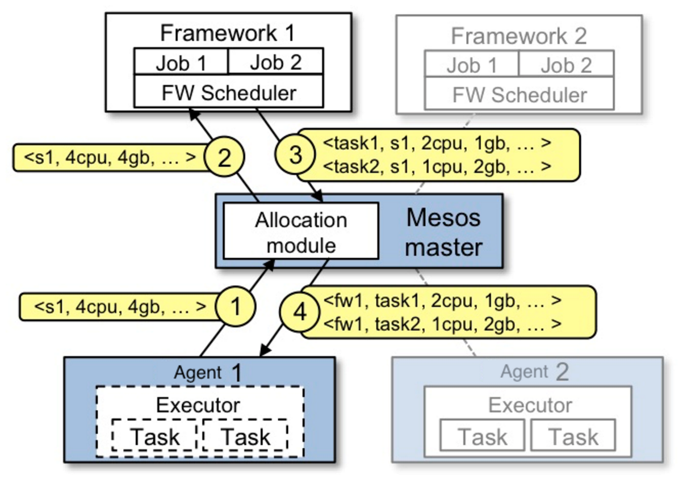

# 作业报告
***
## 1. 用自己的语言描述Mesos的组成结构，指出它们在源码中的具体位置，简单描述一下它们的工作流程

#### Mesos组成架构

上图比较简明扼要地展示了Mesos的主要组成部分。Mesos包括一个*master*守护进程，用来管理运行在各个集群结点上的*agent*守护进程，*Mesos frameworks*在这些agent之上运行各种任务。
master通过*resource offer*在框架间进行资源分配，这种机制使得细粒度的资源共享称为了可能。master会根据现有的分配组织策略（比如均等的分配策略或者有严格优先级的分配策略）来决定对各个框架分别offer多少资源。为了支持多种分配策略，master通过模块化架构和模块插入机制使其较为简单地实现。
在Mesos之上运行地framework包括两个组成部分：一个scheduler负责向master注册，以及接受或者拒绝master的资源offer；另一个executor运行在agent结点上，执行framework的任务。master决定配给一个framework多少资源，而该framework的scheduler选择到底用哪一个被分配的资源。当一个framework接受资源offer，它会将任务描述发送给Mesos，然后Mesos将这些任务在agent上启动。

在源代码中的位置如下
* master: [mesos-1.1.0/src/master](../mesos-1.1.0/mesos-1.1.0/src/master)
* agent(slave): [mesos-1.1.0/src/slave](../mesos-1.1.0/mesos-1.1.0/src/slave)
* framework-scheduler: [mesos-1.1.0/src/scheduler](../mesos-1.1.0/mesos-1.1.0/src/scheduler)
* framework-executer: [mesos-1.1.0/src/executer](../mesos-1.1.0/mesos-1.1.0/src/executer)

#### Resource offer 的流程

下图是一个很好的从资源offer到任务运行的例子:

主要经过下面4个步骤:

1. Agent 1 向master报告它有4个CPU和4GB内存可用。于是master启用分配模块，得知framework 1 应该分配所有当前可用的资源。
2. master发送向framework 1 发送resource offer，告诉framework 1 在agent 1 上有哪些可用的资源。
3. framework 1 的scheduler发送信息回应master，描述了将要在agent上运行的两个任务，第一个任务需要2个CPU、1GB内存，第二个任务需要1个CPU、2GB内存。
4. 最终，master将任务发送给agent，并且分配相应的资源给framework的executer，然后executor就在agent上运行那两个任务。因为agnet 1 上还有1个CPU和1GB内存没有被分配，master的分配模块可能将其分配给framework 2.

值得一提的是，当master的资源offer无法满足framework的要求，framework可以拒绝该offer，并且等待直到一个满足要求的offer出现。

#### 具体代码分析

##### Master

master目录中和运行流程有关的文件是[main.cpp](../mesos-1.1.0/mesos-1.1.0/src/master/main.cpp)和[master.cpp](../mesos-1.1.0/mesos-1.1.0/src/master/master.cpp)。

##### Agent

##### Framework-Scheduler

##### Framework-Executer

## 2. 用自己的语言描述框架（如Spark On Mesos）在Mesos上的运行过程，并与在传统操作系统上运行程序进行对比

## 3. 叙述master和slave的初始化过程

## 4. 查找资料，简述Mesos的资源调度算法，指出在源代码中的具体位置并阅读，说说你对它的看法

## 5. 写一个完成简单工作的框架(语言自选，需要同时实现scheduler和executor)并在Mesos上运行，在报告中对源码进行说明并附上源码，本次作业分数50%在于本项的完成情况、创意与实用程度。（后面的参考资料一定要读，降低大量难度）
