# 作业报告
***

## 1.描述Linux内核如何对IP数据包进行处理

参考[鸟哥的Linux私房菜](http://cn.linux.vbird.org/linux_server/0250simple_firewall.php)

Linux上主要使用的是内核的Netfilter机制（封包过滤机制）。

所谓的封包过滤，亦即是分析进入主机的网络封包，将封包的表头数据捉出来进行分析，以决定该联机为放行或抵挡的机制。 由于这种方式可以直接分析封包表头数据，所以包括硬件地址(MAC), 软件地址 (IP), TCP, UDP, ICMP 等封包的信息都可以进行过滤分析的功能，因此用途非常的广泛。

Netfilter提供了iptables这个软件来作为防火墙封包过滤的指令。接下来就简要介绍其处理过程:

iptables提供了多个表格，每个表格都定义出自己的默认政策与规则，且每个表格的用途都不相同。每个表格可以有多个链，在进行封包过滤的过程中，防火墙会在一个链上依次比对规则看IP包是否满足，检查不通过则丢弃。iptables的表格示意图如下：

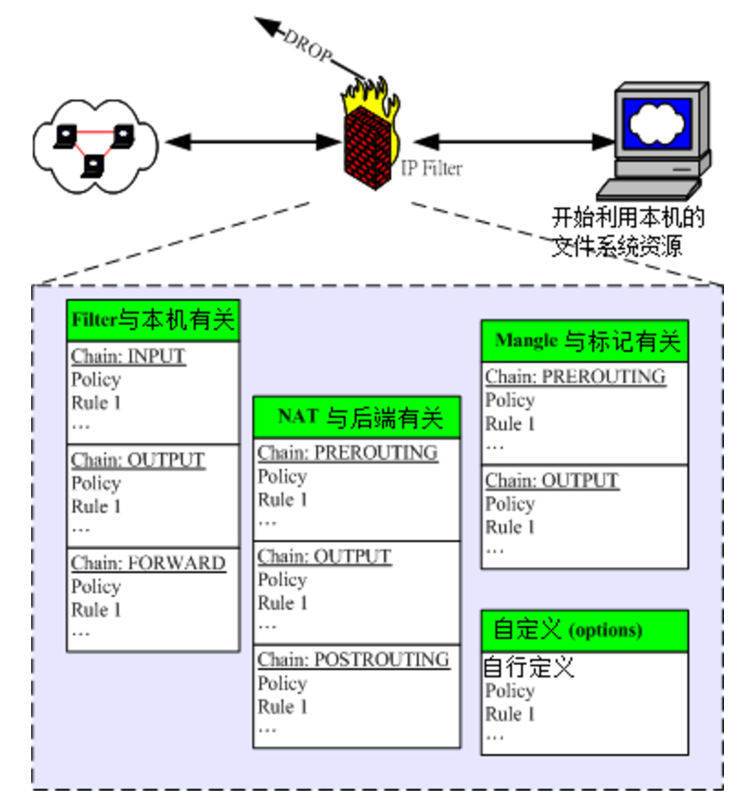

几个重要的表格与其中链的的作用如下：

* filter（过滤器）：主要跟进入Linux本机的数据包有关，是预设的table
	* INPUT：与想进入Linux本机的包有关
	* OUTPUT：与Linux本机想送出的包有关
	* FORWARD：与Linux本机没什么关系，它可以“转递数据包”到后端的计算机中，与下面nat table相关性较高
* nat（地址转换）：是 Network Address Translation 的缩写， 这个表格主要在进行来源与目的之 IP 或 port 的转换，与 Linux 本机较无关，主要与 Linux 主机后的局域网络内计算机较有相关。
	* PREROUTING：在进行路由判断之前所要进行的规则(DNAT/REDIRECT)
	* POSTROUTING：在进行路由判断之后所要进行的规则(SNAT/MASQUERADE)
	* OUTPUT：与发送出去的封包有关
* mangle（破坏者）：这个表格主要是与特殊的封包的路由旗标有关， 早期仅有 PREROUTING 及 OUTPUT 链，不过从 kernel 2.4.18 之后加入了 INPUT 及 FORWARD 链。 由于这个表格与特殊旗标相关性较高，所以像咱们这种单纯的环境当中，较少使用 mangle 这个表格。

各表和链之间的关系如下图：

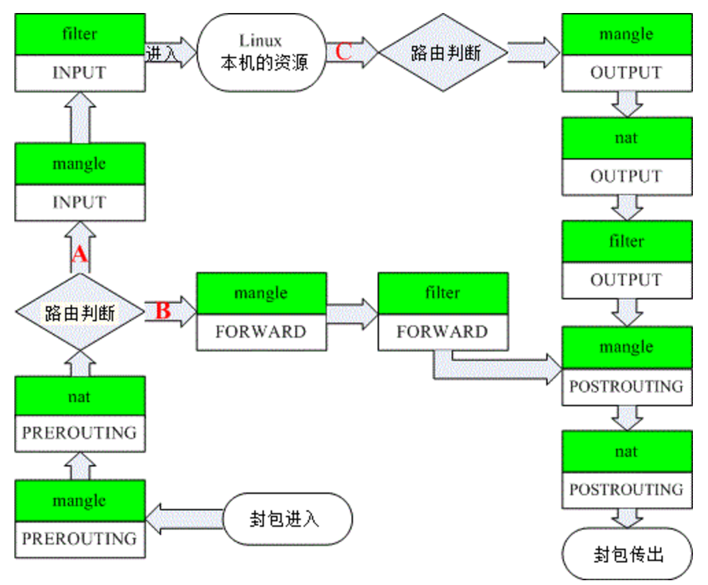

* **封包进入 Linux 主机使用资源 (路径 A)**：在路由判断后确定是向 Linux 主机要求数据的封包，主要就会透过 filter 的 INPUT 链来进行控管；
* **封包经由 Linux 主机的转递，没有使用主机资源，而是向后端主机流动 (路径 B)**： 在路由判断之前进行封包表头的修订作业后，发现到封包主要是要透过防火墙而去后端，此时封包就会透过路径 B 来跑动。 也就是说，该封包的目标并非我们的 Linux 本机。主要经过的链是 filter 的 FORWARD 以及 nat 的 POSTROUTING, PREROUTING。 这路径 B 的封包流向使用情况，我们会在本章的 9.5 小节来跟大家作个简单的介绍。
* **封包由 Linux 本机发送出去 (路径 C)**： 例如响应客户端的要求，或者是 Linux 本机主动送出的封包，都是透过路径 C 来跑的。先是透过路由判断， 决定了输出的路径后，再透过 filter 的 OUTPUT 链来传送的！当然，最终还是会经过 nat 的 POSTROUTING 链。

由于mangle这个表格很少使用，上图去掉mangle表格，就变成了更加简洁的下图：

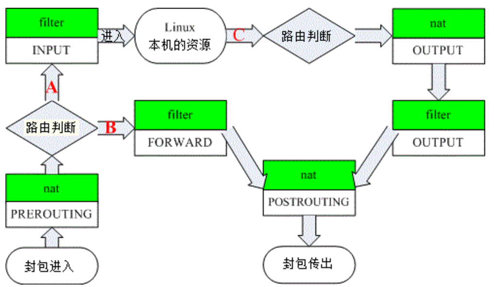

事实上与本机最有关的其实是 filter 这个表格内的 INPUT 与 OUTPUT 这两条链，如果你的 iptables 只是用来保护 Linux 主机本身的话，那 nat 的规则根本就不需要理他，直接设定为开放即可。


## 2.在服务器上测试[iptables]

资料参考[鸟哥的Linux私房菜](http://cn.linux.vbird.org/linux_server/0250simple_firewall.php)

#### 1. 拒绝来自某一特定IP地址的访问

语法规则如下：

```
[root@www ~]# iptables [-AI 链名] [-io 网络接口] [-p 协议] \
> [-s 来源IP/网域] [-d 目标IP/网域] -j [ACCEPT|DROP|REJECT|LOG]
选项与参数：
-AI 链名：针对某的链进行规则的 "插入" 或 "累加"
    -A ：新增加一条规则，该规则增加在原本规则的最后面。例如原本已经有四条规则，
         使用 -A 就可以加上第五条规则！
    -I ：插入一条规则。如果没有指定此规则的顺序，默认是插入变成第一条规则。
         例如原本有四条规则，使用 -I 则该规则变成第一条，而原本四条变成 2~5 号
    链 ：有 INPUT, OUTPUT, FORWARD 等，此链名称又与 -io 有关，请看底下。

-io 网络接口：设定封包进出的接口规范
    -i ：封包所进入的那个网络接口，例如 eth0, lo 等接口。需与 INPUT 链配合；
    -o ：封包所传出的那个网络接口，需与 OUTPUT 链配合；

-p 协定：设定此规则适用于哪种封包格式
   主要的封包格式有： tcp, udp, icmp 及 all 。

-s 来源 IP/网域：设定此规则之封包的来源项目，可指定单纯的 IP 或包括网域，例如：
   IP  ：192.168.0.100
   网域：192.168.0.0/24, 192.168.0.0/255.255.255.0 均可。
   若规范为『不许』时，则加上 ! 即可，例如：
   -s ! 192.168.100.0/24 表示不许 192.168.100.0/24 之封包来源；

-d 目标 IP/网域：同 -s ，只不过这里指的是目标的 IP 或网域。

-j ：后面接动作，主要的动作有接受(ACCEPT)、丢弃(DROP)、拒绝(REJECT)及记录(LOG)
```

在虚拟机上输入命令:

```
iptables -A INPUT -s 123.207.164.155 -j REJECT
```

查看INPUT表，发现新增了如下规则:

```
root@oo-lab:~# iptables -L -n

Chain INPUT (policy ACCEPT)
target     prot opt source               destination
REJECT     all  --  123.207.164.155      0.0.0.0/0            reject-with icmp-port-unreachable
```

使用IP地址``123.207.164.155``的机器访问该虚拟机:

```
ubuntu@VM-128-147-ubuntu:~$ ssh pkusei@162.105.174.21 -p 1001

ssh: connect to host 162.105.174.21 port 1001: Connection refused
```

拒绝访问，配置成功

#### 2. 拒绝来自某一特定mac地址的访问

语法规则如下:

```
[root@www ~]# iptables -A INPUT -m mac --mac-source aa:bb:cc:dd:ee:ff \
> -j ACCEPT
选项与参数：
--mac-source ：就是来源主机的 MAC 啦！
```
使用1002对1001进行测试，使用命令``ifconfig``查到1002的mac地址为``02:00:33:7c:00:02``

在虚拟机上使用命令:

```
iptables -A INPUT -m mac --mac-source 02:00:33:7c:00:02 -j REJECT
```

查看INPUT表，新增规则如下:

```
root@oo-lab:~# iptables -L -n

Chain INPUT (policy ACCEPT)
target     prot opt source               destination
REJECT     all  --  0.0.0.0/0            0.0.0.0/0            MAC 02:00:33:7c:00:02 reject-with icmp-port-unreachable
```

使用1002访问1001:

```
pkusei@oo-lab:~$ ssh pkusei@172.16.1.172

ssh: connect to host 172.16.1.172 port 22: Connection refused
```

拒绝访问，配置成功

#### 3. 只开放本机http服务，其余协议与端口均拒绝

即是只打开tcp协议的80端口

```
# 允许http服务
iptables -A INPUT -p tcp --dport 80 -j ACCEPT
# 关闭其他服务
iptables -P INPUT DROP
```

此时远程登录直接超时断开连接，只能通过燕云自带的终端登录。
查看INPUT表，增加了一条规则:

```
root@oo-lab:~# iptables -L -n

Chain INPUT (policy ACCEPT)
target     prot opt source               destination
ACCEPT     tcp  --  0.0.0.0/0            0.0.0.0/0            tcp dpt:80
```

此时在远程通过``curl``命令可以访问80端口，其余方式均超时,配置成功。


#### 4. 拒绝回应来自某特定IP地址的ping命令

``ping``发送的是一个ICMP(Internet Control Messages Protocol, 因特网信报控制协议)数据包。

因此使用如下格式的命令：

```
[root@www ~]# iptables -A INPUT [-p icmp] [--icmp-type 类型] -j ACCEPT
选项与参数：
--icmp-type ：后面必须要接 ICMP 的封包类型，也可以使用代号，
              例如 8  代表 echo request 的意思。
```

使用1002对1001进行测试，输入如下命令：

```
iptables -A INPUT -p icmp --icmp-type 8 -s 172.16.1.113 -j REJECT
```

测试ping

```
pkusei@oo-lab:~$ ping 172.16.1.172

PING 172.16.1.172 (172.16.1.172) 56(84) bytes of data.
From 172.16.1.172 icmp_seq=1 Destination Port Unreachable
From 172.16.1.172 icmp_seq=2 Destination Port Unreachable
From 172.16.1.172 icmp_seq=3 Destination Port Unreachable
From 172.16.1.172 icmp_seq=4 Destination Port Unreachable
From 172.16.1.172 icmp_seq=5 Destination Port Unreachable
♥
--- 172.16.1.172 ping statistics ---
5 packets transmitted, 0 received, +5 errors, 100% packet loss, time 3997ms
```

无法ping通，配置成功。

## 3. 解释Linux网络设备工作原理

参考[该博客](https://www.ibm.com/developerworks/cn/linux/1310_xiawc_networkdevice/)

#### 1. bridge

Bridge（桥）是 Linux 上用来做 TCP/IP 二层协议交换的设备，与现实世界中的交换机功能相似。Bridge 设备实例可以和 Linux 上其他网络设备实例连接，既 attach 一个从设备，类似于在现实世界中的交换机和一个用户终端之间连接一根网线。当有数据到达时，Bridge 会根据报文中的 MAC 信息进行广播、转发、丢弃处理。

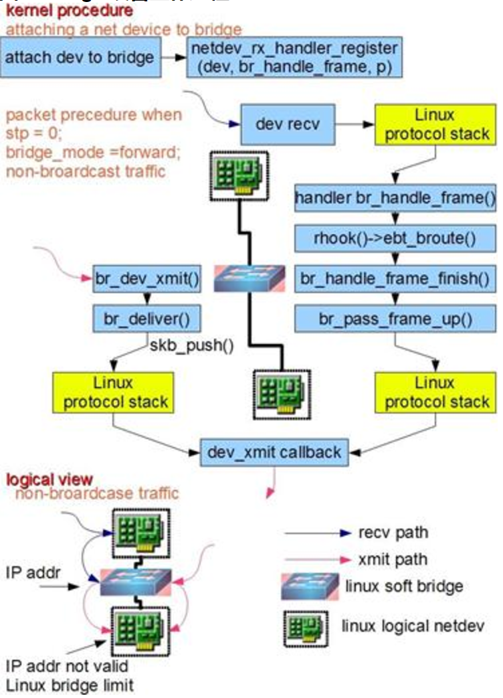

如图所示，Bridge 的功能主要在内核里实现。当一个从设备被 attach 到 Bridge 上时，相当于现实世界里交换机的端口被插入了一根连有终端的网线。这时在内核程序里，netdev_rx_handler_register()被调用，一个用于接受数据的回调函数被注册。以后每当这个从设备收到数据时都会调用这个函数可以把数据转发到 Bridge 上。当 Bridge 接收到此数据时，br_handle_frame()被调用，进行一个和现实世界中的交换机类似的处理过程：判断包的类别（广播/单点），查找内部 MAC 端口映射表，定位目标端口号，将数据转发到目标端口或丢弃，自动更新内部 MAC 端口映射表以自我学习。

Bridge 和现实世界中的二层交换机有一个区别，图中左侧画出了这种情况：数据被直接发到 Bridge 上，而不是从一个端口接受。这种情况可以看做 Bridge 自己有一个 MAC 可以主动发送报文，或者说 Bridge 自带了一个隐藏端口和寄主 Linux 系统自动连接，Linux 上的程序可以直接从这个端口向 Bridge 上的其他端口发数据。所以当一个 Bridge 拥有一个网络设备时，如 bridge0 加入了 eth0 时，实际上 bridge0 拥有两个有效 MAC 地址，一个是 bridge0 的，一个是 eth0 的，他们之间可以通讯。由此带来一个有意思的事情是，Bridge 可以设置 IP 地址。通常来说 IP 地址是三层协议的内容，不应该出现在二层设备 Bridge 上。但是 Linux 里 Bridge 是通用网络设备抽象的一种，只要是网络设备就能够设定 IP 地址。当一个 bridge0 拥有 IP 后，Linux 便可以通过路由表或者 IP 表规则在三层定位 bridge0，此时相当于 Linux 拥有了另外一个隐藏的虚拟网卡和 Bridge 的隐藏端口相连，这个网卡就是名为 bridge0 的通用网络设备，IP 可以看成是这个网卡的。当有符合此 IP 的数据到达 bridge0 时，内核协议栈认为收到了一包目标为本机的数据，此时应用程序可以通过 Socket 接收到它。一个更好的对比例子是现实世界中的带路由的交换机设备，它也拥有一个隐藏的 MAC 地址，供设备中的三层协议处理程序和管理程序使用。设备里的三层协议处理程序，对应名为 bridge0 的通用网络设备的三层协议处理程序，即寄主 Linux 系统内核协议栈程序。设备里的管理程序，对应 bridge0 寄主 Linux 系统里的应用程序。

Bridge 的实现当前有一个限制：当一个设备被 attach 到 Bridge 上时，那个设备的 IP 会变的无效，Linux 不再使用那个 IP 在三层接受数据。举例如下：如果 eth0 本来的 IP 是 192.168.1.2，此时如果收到一个目标地址是 192.168.1.2 的数据，Linux 的应用程序能通过 Socket 操作接受到它。而当 eth0 被 attach 到一个 bridge0 时，尽管 eth0 的 IP 还在，但应用程序是无法接受到上述数据的。此时应该把 IP 192.168.1.2 赋予 bridge0。

另外需要注意的是数据流的方向。对于一个被 attach 到 Bridge 上的设备来说，只有它收到数据时，此包数据才会被转发到 Bridge 上，进而完成查表广播等后续操作。当请求是发送类型时，数据是不会被转发到 Bridge 上的，它会寻找下一个发送出口。用户在配置网络时经常忽略这一点从而造成网络故障。

#### 2. vlan

VLAN 又称虚拟网络，是一个被广泛使用的概念，有些应用程序把自己的内部网络也称为 VLAN。此处主要说的是在物理世界中存在的，需要协议支持的 VLAN。它的种类很多，按照协议原理一般分为：MACVLAN、802.1.q VLAN、802.1.qbg VLAN、802.1.qbh VLAN。其中出现较早，应用广泛并且比较成熟的是 802.1.q VLAN，其基本原理是在二层协议里插入额外的 VLAN 协议数据（称为 802.1.q VLAN Tag)，同时保持和传统二层设备的兼容性。Linux 里的 VLAN 设备是对 802.1.q 协议的一种内部软件实现，模拟现实世界中的 802.1.q 交换机。

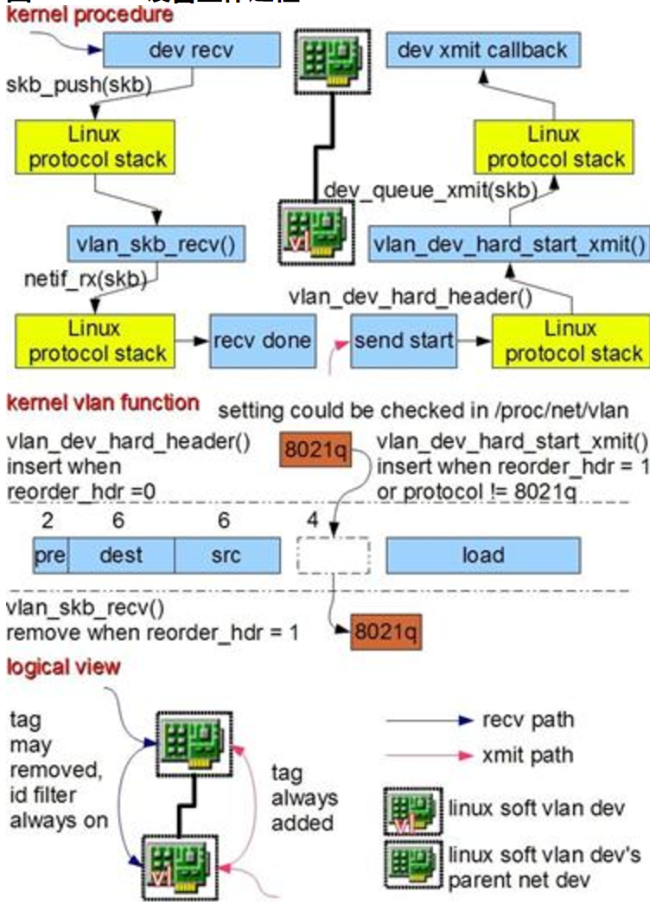

如图所示，Linux 里 802.1.q VLAN 设备是以母子关系成对出现的，母设备相当于现实世界中的交换机 TRUNK 口，用于连接上级网络，子设备相当于普通接口用于连接下级网络。当数据在母子设备间传递时，内核将会根据 802.1.q VLAN Tag 进行对应操作。母子设备之间是一对多的关系，一个母设备可以有多个子设备，一个子设备只有一个母设备。当一个子设备有一包数据需要发送时，数据将被加入 VLAN Tag 然后从母设备发送出去。当母设备收到一包数据时，它将会分析其中的 VLAN Tag，如果有对应的子设备存在，则把数据转发到那个子设备上并根据设置移除 VLAN Tag，否则丢弃该数据。在某些设置下，VLAN Tag 可以不被移除以满足某些监听程序的需要，如 DHCP 服务程序。举例说明如下：eth0 作为母设备创建一个 ID 为 100 的子设备 eth0.100。此时如果有程序要求从 eth0.100 发送一包数据，数据将被打上 VLAN 100 的 Tag 从 eth0 发送出去。如果 eth0 收到一包数据，VLAN Tag 是 100，数据将被转发到 eth0.100 上，并根据设置决定是否移除 VLAN Tag。如果 eth0 收到一包包含 VLAN Tag 101 的数据，其将被丢弃。上述过程隐含以下事实：对于寄主 Linux 系统来说，母设备只能用来收数据，子设备只能用来发送数据。和 Bridge 一样，母子设备的数据也是有方向的，子设备收到的数据不会进入母设备，同样母设备上请求发送的数据不会被转到子设备上。可以把 VLAN 母子设备作为一个整体想象为现实世界中的 802.1.q 交换机，下级接口通过子设备连接到寄主 Linux 系统网络里，上级接口同过主设备连接到上级网络，当母设备是物理网卡时上级网络是外界真实网络，当母设备是另外一个 Linux 虚拟网络设备时上级网络仍然是寄主 Linux 系统网络。

需要注意的是母子 VLAN 设备拥有相同的 MAC 地址，可以把它当成现实世界中 802.1.q 交换机的 MAC，因此多个 VLAN 设备会共享一个 MAC。当一个母设备拥有多个 VLAN 子设备时，子设备之间是隔离的，不存在 Bridge 那样的交换转发关系，原因如下：802.1.q VLAN 协议的主要目的是从逻辑上隔离子网。现实世界中的 802.1.q 交换机存在多个 VLAN，每个 VLAN 拥有多个端口，同一 VLAN 端口之间可以交换转发，不同 VLAN 端口之间隔离，所以其包含两层功能：交换与隔离。Linux VLAN device 实现的是隔离功能，没有交换功能。一个 VLAN 母设备不可能拥有两个相同 ID 的 VLAN 子设备，因此也就不可能出现数据交换情况。如果想让一个 VLAN 里接多个设备，就需要交换功能。在 Linux 里 Bridge 专门实现交换功能，因此将 VLAN 子设备 attach 到一个 Bridge 上就能完成后续的交换功能。总结起来，Bridge 加 VLAN device 能在功能层面完整模拟现实世界里的 802.1.q 交换机。

Linux 支持 VLAN 硬件加速，在安装有特定硬件情况下，图中所述内核处理过程可以被放到物理设备上完成。

#### 3. tap与veth

TUN/TAP 设备是一种让用户态程序向内核协议栈注入数据的设备，一个工作在三层，一个工作在二层，使用较多的是 TAP 设备。VETH 设备出现较早，它的作用是反转通讯数据的方向，需要发送的数据会被转换成需要收到的数据重新送入内核网络层进行处理，从而间接的完成数据的注入。

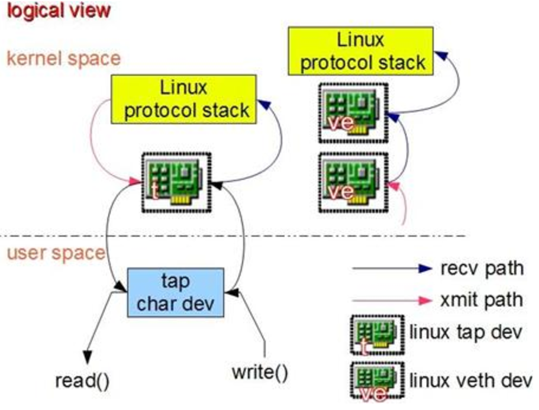

如图所示，当一个 TAP 设备被创建时，在 Linux 设备文件目录下将会生成一个对应 char 设备，用户程序可以像打开普通文件一样打开这个文件进行读写。当执行 write()操作时，数据进入 TAP 设备，此时对于 Linux 网络层来说，相当于 TAP 设备收到了一包数据，请求内核接受它，如同普通的物理网卡从外界收到一包数据一样，不同的是其实数据来自 Linux 上的一个用户程序。Linux 收到此数据后将根据网络配置进行后续处理，从而完成了用户程序向 Linux 内核网络层注入数据的功能。当用户程序执行 read()请求时，相当于向内核查询 TAP 设备上是否有需要被发送出去的数据，有的话取出到用户程序里，完成 TAP 设备的发送数据功能。针对 TAP 设备的一个形象的比喻是：使用 TAP 设备的应用程序相当于另外一台计算机，TAP 设备是本机的一个网卡，他们之间相互连接。应用程序通过 read()/write()操作，和本机网络核心进行通讯。

VETH 设备总是成对出现，送到一端请求发送的数据总是从另一端以请求接受的形式出现。该设备不能被用户程序直接操作，但使用起来比较简单。创建并配置正确后，向其一端输入数据，VETH 会改变数据的方向并将其送入内核网络核心，完成数据的注入。在另一端能读到此数据。

## 4. 说明在calico网络中，一个数据包从源容器发送到目标容器接收的具体过程

参考[calico官方文档](http://docs.projectcalico.org/v2.1/reference/architecture/data-path)和[该博客](http://www.sdnlab.com/17161.html)以及[该博客](http://blog.csdn.net/yarntime/article/details/51258824)

#### 架构

Calico 是一个三层的数据中心网络方案，而且方便集成 OpenStack 这种 IaaS 云架构，能够提供高效可控的 VM、容器、裸机之间的通信。

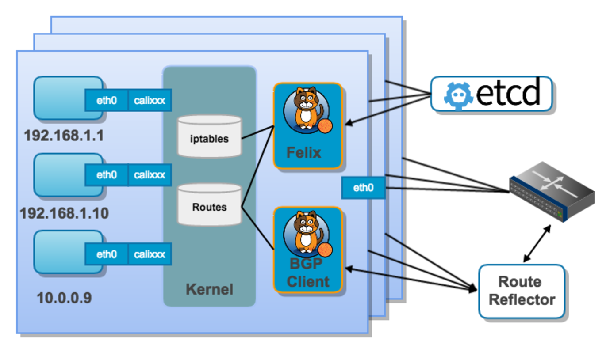

上图显示了calico的核心组件:
* Felix，Calico agent，跑在每台需要运行 workload 的节点上，主要负责配置路由及 ACLs 等信息来确保 endpoint 的连通状态；
* etcd，分布式键值存储，主要负责网络元数据一致性，确保 Calico 网络状态的准确性；
* BGP Client(BIRD), 主要负责把 Felix 写入 kernel 的路由信息分发到当前 Calico 网络，确保 workload 间的通信的有效性；
* BGP Route Reflector(BIRD), 大规模部署时使用，摒弃所有节点互联的 mesh 模式，通过一个或者多个 BGP Route Reflector 来完成集中式的路由分发；

#### 网络通信模型

当容器通过calico进行跨主机通信时，其网络通信模型如下图所示:

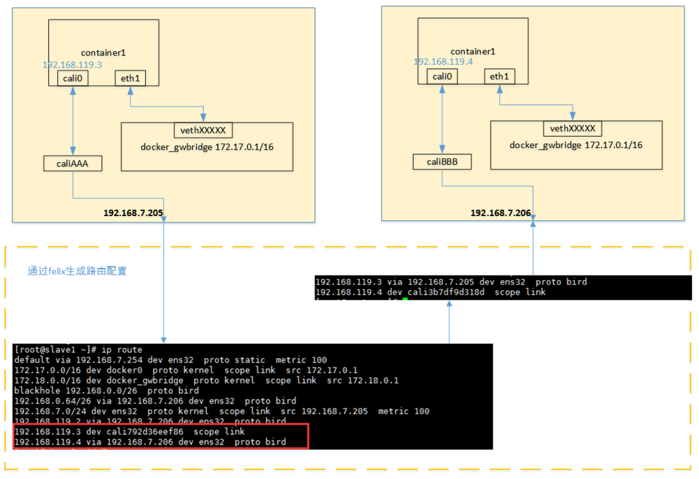

从上图可以看出，当容器创建时，calico为容器生成veth pair，一端作为容器网卡加入到容器的网络命名空间，并设置IP和掩码，一端直接暴露在宿主机上，并通过设置路由规则，将容器IP暴露到宿主机的通信路由上。于此同时，calico为每个主机分配了一段子网作为容器可分配的IP范围，这样就可以根据子网的CIDR为每个主机生成比较固定的路由规则。

当容器需要跨主机通信时，主要经过下面的简单步骤：

1.  容器流量通过veth pair到达宿主机的网络命名空间上。
2.  根据容器要访问的IP所在的子网CIDR和主机上的路由规则，找到下一跳要到达的宿主机IP。
3.  流量到达下一跳的宿主机后，根据当前宿主机上的路由规则，直接到达对端容器的veth pair插在宿主机的一端，最终进入容器。


来自或进入workload的IP包都是用workload的宿主的路由表进行路由，用iptables实现防火墙的功能。在Calico中，数据包有可能跨多个节点传输，但是无需对那些中间节点进行配置。对于一个被送到workload的数据包，最后的一跳是从该workload的宿主到workload自身：

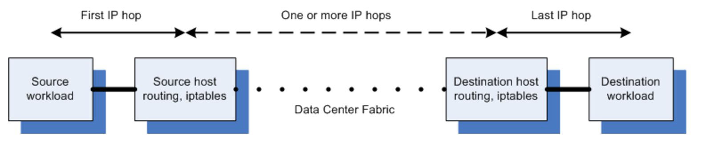


## 5. 调研除calico以外的一种容器网络方案，比较其与calico的优缺点

参考[该博客](http://blog.csdn.net/yarntime/article/details/51258824)

#### weave

weave通过在docker集群的每个主机上启动虚拟的路由器，将主机作为路由器，形成互联互通的网络拓扑，在此基础上，实现容器的跨主机通信。其主机网络拓扑参见下图： 

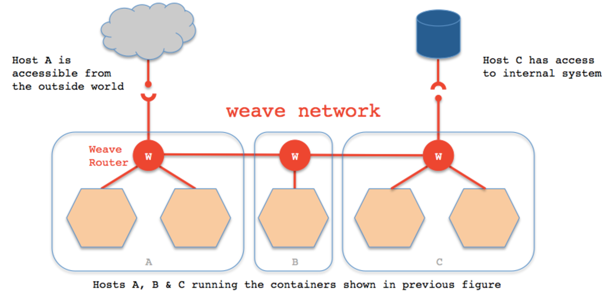

如上图所示，在每一个部署Docker的主机（可能是物理机也可能是虚拟机）上都部署有一个W（即weave router，它本身也可以以一个容器的形式部署）。weave网络是由这些weave routers组成的对等端点（peer）构成，并且可以通过weave命令行定制网络拓扑。

每个部署了weave router的主机之间都会建立TCP和UDP两个连接，保证weave router之间控制面流量和数据面流量的通过。控制面由weave routers之间建立的TCP连接构成，通过它进行握手和拓扑关系信息的交换通信。控制面的通信可以被配置为加密通信。而数据面由weave routers之间建立的UDP连接构成，这些连接大部分都会加密。这些连接都是全双工的，并且可以穿越防火墙。 

#### 网络通信模型

当容器通过weave进行跨主机通信时，其网络通信模型可以参考下图： 

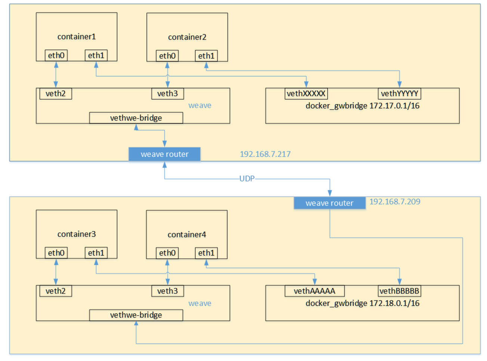

从上面的网络模型图中可以看出，对每一个weave网络中的容器，weave都会创建一个网桥，并且在网桥和每个容器之间创建一个veth pair，一端作为容器网卡加入到容器的网络命名空间中，并为容器网卡配置ip和相应的掩码，一端连接在网桥上，最终通过宿主机上weave router将流量转发到对端主机上。其基本过程如下：

1. 容器流量通过veth pair到达宿主机上weave router网桥上。
2. weave router在混杂模式下使用pcap在网桥上截获网络数据包，并排除由内核直接通过网桥转发的数据流量，例如本子网内部、本地容器之间的数据以及宿主机和本地容器之间的流量。捕获的包通过UDP转发到所其他主机的weave router端。
3. 在接收端，weave router通过pcap将包注入到网桥上的接口，通过网桥的上的veth pair，将流量分发到容器的网卡上。

#### 优缺点

###### calico缺点

* calico目前只支持TCP、UDP、ICMP、ICMPv6协议，如果使用其他四层协议（例如NetBIOS协议），建议使用weave、原生overlay等其他overlay网络实现。
* 基于三层实现通信，在二层上没有任何加密包装，因此只能在私有的可靠网络上使用。
* 流量隔离基于iptables实现，并且从etcd中获取需要生成的隔离规则，有一些性能上的隐患。

###### weave缺点

* weave自定义容器数据包的封包解包方式，不够通用，传输效率比较低，性能上的损失也比较大。
* 集群配置比较负载，需要通过weave命令行来手工构建网络拓扑，在大规模集群的情况下，加重了管理员的负担。


## 6. 编写一个mesos framework，使用calico容器网络搭建一个docker容器集群

#### 安装etcd

参考[etcd的github主页](https://github.com/coreos/etcd)

在三台虚拟机上使用下面命令安装etcd

```
apt-get install etcd
```

在三台虚拟机上分别使用如下命令配置:

1001:
```
nohup \
etcd --name 1001 --initial-advertise-peer-urls http://172.16.1.172:2380 \
  --listen-peer-urls http://172.16.1.172:2380 \
  --listen-client-urls http://172.16.1.172:2379,http://127.0.0.1:2379 \
  --advertise-client-urls http://172.16.1.172:2379 \
  --initial-cluster-token etcd-cluster-1 \
  --initial-cluster 1001=http://172.16.1.172:2380,1002=http://172.16.1.113:2380,1003=http://172.16.1.157:2380 \
  --initial-cluster-state new &
```
1002:
```
nohup \
etcd --name 1002 --initial-advertise-peer-urls http://172.16.1.113:2380 \
  --listen-peer-urls http://172.16.1.113:2380 \
  --listen-client-urls http://172.16.1.113:2379,http://127.0.0.1:2379 \
  --advertise-client-urls http://172.16.1.113:2379 \
  --initial-cluster-token etcd-cluster-1 \
  --initial-cluster 1001=http://172.16.1.172:2380,1002=http://172.16.1.113:2380,1003=http://172.16.1.157:2380 \
  --initial-cluster-state new &
```
1003:
```
nohup \
etcd --name 1003 --initial-advertise-peer-urls http://172.16.1.157:2380 \
  --listen-peer-urls http://172.16.1.157:2380 \
  --listen-client-urls http://172.16.1.157:2379,http://127.0.0.1:2379 \
  --advertise-client-urls http://172.16.1.157:2379 \
  --initial-cluster-token etcd-cluster-1 \
  --initial-cluster 1001=http://172.16.1.172:2380,1002=http://172.16.1.113:2380,1003=http://172.16.1.157:2380 \
  --initial-cluster-state new &
```

配置完成后检查配置状态

```
pkusei@oo-lab:~$ etcdctl cluster-health

member 6851fcd7075cc418 is healthy: got healthy result from http://172.16.1.157:2379
member 8b993d25c85d63be is healthy: got healthy result from http://172.16.1.172:2379
member e727c0f5e65b0c4b is healthy: got healthy result from http://172.16.1.113:2379
cluster is healthy
```

说明集群配置完好

#### 配置Docker daemon


在每一台主机上配置docker daemon，使docker支持etcd

```
dockerd --cluster-store etcd://172.16.1.172:2379 &
```

#### 安装calico

参照[calico官方文档](http://docs.projectcalico.org/v2.1/getting-started/mesos/installation/integration)

在每一台机器上下载并安装calico

下载

```
sudo wget -O /usr/local/bin/calicoctl https://github.com/projectcalico/calicoctl/releases/download/v1.1.3/calicoctl
sudo chmod +x /usr/local/bin/calicoctl
```

在每台机器上启动calico容器

```
# 启动calico容器
root@oo-lab:~# sudo calicoctl node run --ip 172.16.1.172 --name 1001

# 查看当前运行容器，新增了一个
root@oo-lab:~# docker ps

CONTAINER ID        IMAGE                        COMMAND             CREATED             STATUS              PORTS               NAMES
ab86f6ba5c10        quay.io/calico/node:v1.1.3   "start_runit"       14 hours ago        Up 14 hours                             calico-node
```

检查node状态

```
pkusei@oo-lab:~$ sudo calicoctl node status

Calico process is running.

IPv4 BGP status
+--------------+-------------------+-------+----------+-------------+
| PEER ADDRESS |     PEER TYPE     | STATE |  SINCE   |    INFO     |
+--------------+-------------------+-------+----------+-------------+
| 172.16.1.113 | node-to-node mesh | up    | 11:41:01 | Established |
| 172.16.1.157 | node-to-node mesh | up    | 11:41:29 | Established |
+--------------+-------------------+-------+----------+-------------+

IPv6 BGP status
No IPv6 peers found.
```

calico已经正确安装好

#### 配置网络

创建calico ip池
```
cat << EOF | calicoctl apply -f -
- apiVersion: v1
  kind: ipPool
  metadata:
    cidr: 192.168.0.0/16
  spec:
    nat-outgoing: true
EOF
```

创建docker网络
```
docker network create --driver calico --ipam-driver calico-ipam --subnet=192.168.0.0/16 calico_test_net
```

检查创建的网络
```
root@oo-lab:~/workspace# docker network ls

NETWORK ID          NAME                DRIVER              SCOPE
eb8ff0feb13b        bridge              bridge              local
d9ad28397b90        calico_test_net     calico              global
65b83d0faa0b        host                host                local
9d4ba95f7352        none                null                local
```

发现新增了名为``calico_test_net``的网络，容器可以通过该网络获得自己的ip并且互联

#### 安装configurable-http-proxy

configurable-http-proxy用于容器和宿主机之间的端口映射，使得可以访问容器中运行的jupyter notebook
```
apt-get install -y npm nodejs-legacy
npm install -g configurable-http-proxy
```

#### 镜像制作

容器之间需要可以相互登录，故都需安装ssh，其中有一个容器需要额外安装jupyter作为外界管理的窗口

仅安装ssh的镜像的dockerfile:
```
FROM ubuntu:latest

# 安装ssh
RUN apt-get update
RUN apt-get install -y ssh

# 创建账号用以登录
RUN useradd -m calico
RUN echo "calico:calico" | chpasswd

# 创建sshd使用的目录
RUN mkdir /var/run/sshd

# 开放22端口并用root前台运行sshd
USER root
EXPOSE 22
CMD ["/usr/sbin/sshd","-D"]
```

安装ssh和jupyter的镜像的dockerfile:
```
FROM ubuntu:latest

# 安装ssh和jupyter
RUN apt-get update
RUN apt-get install -y ssh python3-pip
RUN pip3 install jupyter

# 创建账号用以登录
RUN useradd -m calico
RUN echo "calico:calico" | chpasswd

# 创建sshd使用的目录
RUN mkdir /var/run/sshd

# 开放22端口并前台运行jupyter
USER calico
EXPOSE 22
WORKDIR /home/calico
CMD ["jupyter","notebook","--NotebookApp.token=","--ip=192.168.0.1"]
```

#### mesos framework

使用task运行容器

在第一个容器中使用带有jupyter的镜像，其余使用仅装有ssh的镜像

外部通过浏览器访问jupyter notebook比较复杂，需要通过一系列转发链:

	外网-->集群某一特定机器-->运行jupyter容器的机器-->jupyter容器

其中外网到集群中某一特定机器端口转发可以通过燕云确定。而mesos分配的运行jupyter容器的机器却是不确定的，因此需要在task分配的过程中，动态地通过configurable-http-proxy配置，使特定机器转发到运行jupyter容器的机器。而机器到容器的端口映射不好通过远程控制，因此只好提前设置好。

在agent上提前设置机器到jupyter容器的转发:
```
# 在1002上
nohup configurable-http-proxy --default-target=http://192.168.0.1:8888 --ip=172.16.1.113 --port=8888 &

# 在1003上
nohup configurable-http-proxy --default-target=http://192.168.0.1:8888 --ip=172.16.1.157 --port=8888 &
```
scheduler的总体思想是：10个task，运行10个容器，其中第一个是带jupyter的，其余只带ssh。当分配第一个task时，查看offer来的资源是从那个agent来的，在master（master就是和外网端口映射的机器）上建立端口映射，映射到对应agent机器，然后用jupyter镜像制作容器。剩下的task都使用ssh镜像制作容器。

下面是scheduler的代码
[my_scheduler.py](./my_scheduler.py):
```

import re
import sys
import uuid
import logging
import time
import socket
import signal
import getpass
import subprocess
from threading import Thread
from os.path import abspath, join, dirname

from pymesos import MesosSchedulerDriver, Scheduler, encode_data, decode_data
from addict import Dict

TASK_CPU = 0.1
TASK_MEM = 96
TASK_NUM = 10

EXECUTOR_CPUS = 0.2
EXECUTOR_MEM = 192

AGENT_1 = '6293002e-35cc-4827-a62b-b0412bb5218c-S0'
AGENT_2 = '6293002e-35cc-4827-a62b-b0412bb5218c-S1'

class MyScheduler(Scheduler):

    def __init__(self):
        self.task_launched = 0


    # invoked when resources have been offered to this framework
    def resourceOffers(self, driver, offers):
        filters = {'refuse_seconds': 5}

        # if all tasks have been launched, return directly 
        if self.task_launched == TASK_NUM:
            return 

        # for every offer
        for offer in offers:
            if self.task_launched == TASK_NUM:
                return 
            print(self.task_launched)
            # check if the offer satisfy the requirments
            cpus = self.getResource(offer.resources, 'cpus')
            mem = self.getResource(offer.resources, 'mem')
            if cpus < TASK_CPU or mem < TASK_MEM:
                continue

            # the 1st task to launch jupyter
            if self.task_launched == 0:
                # get agent_id
                agent_id = offer.agent_id.value

                
                # set proxy
                if agent_id == AGENT_1:
                    subprocess.Popen(['/usr/local/bin/configurable-http-proxy',
                                      '--default-target=http://172.16.1.113:8888',
                                      '--ip=172.16.1.172',
                                      '--port=8888'])
                else:
                    subprocess.Popen(['/usr/local/bin/configurable-http-proxy',
                                      '--default-target=http://172.16.1.157:8888',
                                      '--ip=172.16.1.172',
                                      '--port=8888'])
                
                # config a new task

                # network
                networkInfo = Dict()
                networkInfo.name = 'calico_test_net'

                # ip
                ip = Dict()
                ip.key = 'ip'
                ip.value = '192.168.0.1'

                # docker
                dockerInfo = Dict()
                dockerInfo.image = 'esddse/docker-jupyter'
                dockerInfo.network = 'USER'
                dockerInfo.parameters = [ip]

                # container
                containerInfo = Dict()
                containerInfo.type = 'DOCKER'
                containerInfo.docker = dockerInfo
                containerInfo.network_infos = [networkInfo]

                # task
                commandInfo = Dict()
                commandInfo.shell = False

                task = Dict()
                task_id = str(self.task_launched+1)
                task.task_id.value = task_id
                task.agent_id.value = offer.agent_id.value
                task.name = 'jupyter'
                task.container = containerInfo
                task.command = commandInfo

                task.resources = [
                    dict(name='cpus', type='SCALAR', scalar={'value': TASK_CPU}),
                    dict(name='mem', type='SCALAR', scalar={'value': TASK_MEM}),
                ]

            else:
                # config a new task

                # network
                networkInfo = Dict()
                networkInfo.name = 'calico_test_net'

                # ip
                ip = Dict()
                ip.key = 'ip'
                ip.value = '192.168.0.' + str(self.task_launched+1)

                # docker
                dockerInfo = Dict()
                dockerInfo.image = 'esddse/docker-ssh'
                dockerInfo.network = 'USER'
                dockerInfo.parameters = [ip]

                # container
                containerInfo = Dict()
                containerInfo.type = 'DOCKER'
                containerInfo.docker = dockerInfo
                containerInfo.network_infos = [networkInfo]

                # task
                commandInfo = Dict()
                commandInfo.shell = False

                task = Dict()
                task_id = str(self.task_launched+1)
                task.task_id.value = task_id
                task.agent_id.value = offer.agent_id.value
                task.name = 'ssh'
                task.container = containerInfo
                task.command = commandInfo

                task.resources = [
                    dict(name='cpus', type='SCALAR', scalar={'value': TASK_CPU}),
                    dict(name='mem', type='SCALAR', scalar={'value': TASK_MEM}),
                ]
                

            # launch task
            driver.launchTasks(offer.id, [task], filters)

            self.task_launched += 1


    def getResource(self, res, name):
        for r in res:
            if r.name == name:
                return r.scalar.value
        return 0.0

    # invoked when the status of a task has changed
    # eg: executorDriver call sendStateUpdate()
    def statusUpdate(self, driver, update):
        # log
        logging.debug('Status update TID %s %s',
                      update.task_id.value,
                      update.state)

```

下面是运行结果：


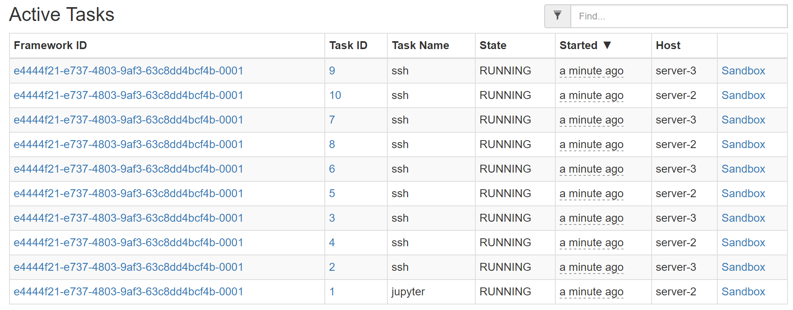

通过外网访问jupyter notebook可轻松对容器网络进行管理，可通过[http://162.105.174.21:8888/terminals/1](http://162.105.174.21:8888/terminals/1)进行访问


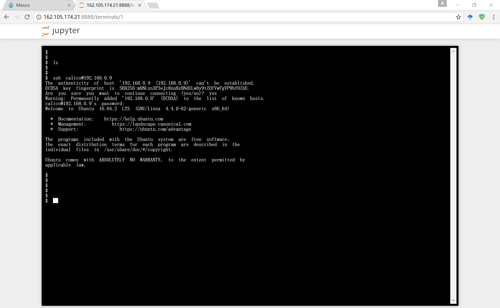


