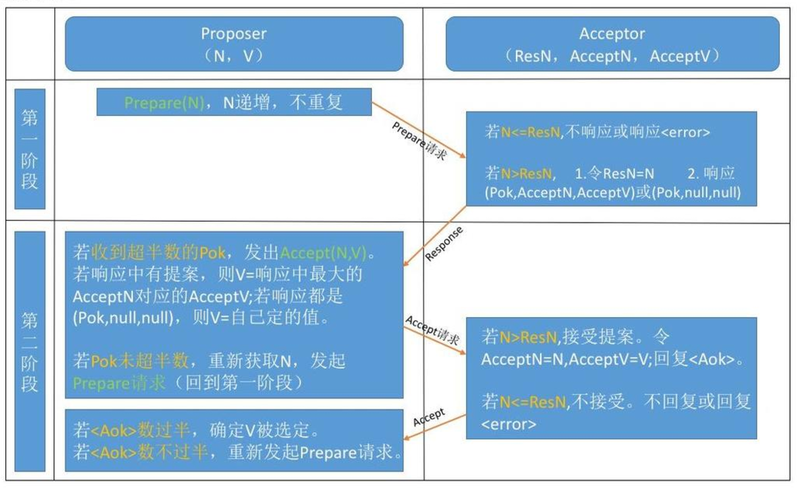
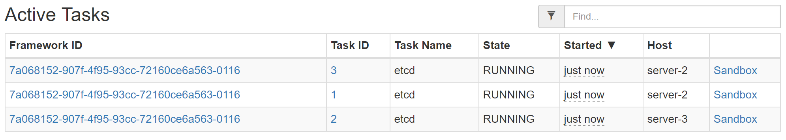

# 作业报告
***

## 1. 阅读Paxos算法的材料并用自己的话简单叙述

参考[该博客](http://www.cnblogs.com/linbingdong/p/6253479.html)

#### 相关概念

在Paxos算法中，有三种角色:
* Proposer
* Acceptor
* Learner

在具体的实现中，一个进程可能同时充当多种角色。比如一个进程可能既是Proposer又是Acceptor又是Learner。

另外一个重要的概念提案（Proposal）。最重要达成一致的value就在提案里。

Proposer可以提出（propose）提案；Acceptor可以接受（accept）提案；如果某个提案被选定（chosen），那么该提案里的value就被选定了。如果Proposer、Acceptor、Learner都认为同一个value被选定（chosen），就称为“对某个数据达成一致”。

#### 问题描述

假设有一组可以提出（propose）value（value在提案Proposal里）的进程集合。一个一致性算法需要保证提出的这么多value中，只有一个value被选定（chosen）。如果没有value被提出，就不应该有value被选定。如果一个value被选定，那么所有进程都应该能学习（learn）到这个被选定的value。对于一致性算法，安全性（safaty）要求如下：
* 只有被提出的value才能被选定
* 只有一个value被选定，并且
* 如果某个进程认为某个value被选定，那么这个value必须是真的被选定的那个

不同角色之间可以通过发送消息来进行通信，消息在传递过程中可能出现任意时长的延迟，可能会重复，也可能丢失。但是消息不会被损坏，即消息内容不会被篡改

Paxos的目标：保证最终有一个value会被选定，当value被选定后，进程最终也能获取到被选定的value

#### Paxos算法描述

Paxos算法分为**两个阶段**，具体如下：

* 阶段一
	1. Proposer选择一个提案编号N，然后向半数以上的Acceptor发送编号为N的Prepare请求。
	2. 如果一个Acceptor收到一个编号为N的Prepare请求，且N大于该Acceptor已经响应过的所有Prepare请求的编号，那么它就会将它已经接受过的编号最大的提案（如果有的话）作为响应反馈给Proposer，同时该Acceptor承诺不再接受任何编号小于N的提案。 
* 阶段二
	1. 如果Proposer收到半数以上Acceptor对其发出的编号为N的Prepare请求的响应，那么它就会发送一个针对[N,V]提案的Accept请求给半数以上的Acceptor。注意：V就是收到的响应中编号最大的提案的value，如果响应中不包含任何提案，那么V就由Proposer自己决定。
	2. 如果Acceptor收到一个针对编号为N的提案的Accept请求，只要该Acceptor没有对编号大于N的Prepare请求做出过响应，它就接受该提案。



#### Learner学习被选定的value

Learner学习（获取）被选定的value有如下三种方案：


## 2. 模拟Raft协议工作的一个场景并叙述处理过程

参考[该博客](http://www.jdon.com/artichect/raft.html)

在Raft中，任何时候一个服务器可以扮演下面三种角色之一:
* Leader：处理所有客户端交互，日志复制等，一般一次只有一个Leader
* Follower: 类似选民，完全被动
* Candidate: 类似Proposer律师，可以被选为一个新的领导人

Raft阶段分为两个，首先是选举过程，然后在选举出来的领导人带领进行正常操作，比如日志复制等。

#### 选举

Raft使用心跳机制触发leader选举。当服务器启动时，它们一开始都是follower。follower只要能够接收到来自leader和candidate的信号，就能够一直保持follower状态。如果有一个follower未接收到信号的时间超过其election timeout，它会假定不存在leader，从而转换成cadidate开启新一轮选举。

candidate有权发起投票，它向其他服务器发起投票请求，并将将自己仅有的一票投给自己。其他服务器收到投票请求后，会给candidate投票。当candidate收到超过一半的投票后就成为leader。Raft系统中只有leader才有权利接收并处理client请求，并向其它服务器发出添加日志请求来提交日志。

#### 日志复制

leader选举出来以后，就可以开始处理客户端请求。leader收到client的请求后，将请求内容加入到自己的日志中，并向其他服务器发送添加日志请求。其它服务器收到添加日志请求后，判断该请求是否满足接收条件，若满足则将其加入到本地日志中，并发送response。leader受到大多数服务器添加成功的response后，就将那条日志正式提交。提交后的日志就意味着已经被Raft系统接受，并能应用到状态机中了。

## 3. 简述Mesos的容错机制并验证

[参考文章](http://www.infoq.com/cn/articles/analyse-mesos-part-03/)

Mesos可以在下列三个层面上实现容错:
* **Master**：Mesos使用热备份（hot-standby）设计来实现Master节点集合，一个Master结点与多个备用（standby）结点运行在同一集群中，并由开源软件Zookeeper来监控。Zookeeper会监控Master集群中所有的节点，并在Master节点发生故障时管理新Master的选举。当一个新的Master当选后，Zookeeper会通知Framework和选举后的Slave节点集合，以便使其在新的Master上注册。彼时，新的 Master可以根据Framework和Slave节点集合发送过来的信息，重建内部状态。
* **Framework Scheduler**：Framework调度器的容错是通过Framework将调度器注册2份或者更多份到Master来实现。当一个调度器发生故障时，Master会通知另一个调度来接管。需要注意的是Framework自身负责实现调度器之间共享状态的机制。
* **Slave**：Mesos实现了Slave的恢复功能，当Slave节点上的进程失败时，可以让执行器/任务继续运行，并为那个Slave进程重新连接那台Slave节点上运行的执行器/任务。当任务执行时，Slave会将任务的监测点元数据存入本地磁盘。如果Slave进程失败，任务会继续运行，当Master重新启动Slave进程后，因为此时没有可以响应的消息，所以重新启动的Slave进程会使用检查点数据来恢复状态，并重新与执行器/任务连接。

其中Framework Scheduler和Slave的错误是容易解决的，只要master检测到，并且执行相应处理程序即可。而Master的容错主要是通过Zookeeper模块执行的。在这里我们只验证Master失效的情况。

#### Zookeeper配置及Master宕机测试

在三台机器上修改``/etc/hosts``如下:

```
172.16.1.172  server-1
172.16.1.113  server-2
172.16.1.113  server-3
```

zookeeper在安装mesos时已经安装好，使用``locate``命令找到其配置文件路径为``/etc/zookeeper/conf/zoo.cfg``

在三台机器上修改其内容，加入三台虚拟机的hostname:

```
# specify all zookeeper servers
# The fist port is used by followers to connect to the leader
# The second one is used for leader election
server.1=server-1:2888:3888
server.2=server-2:2888:3888
server.3=server-3:2888:3888
```

根据配置文件中的数据地址,修改``/var/lib/zookeeper/myid``内容为上面对应的服务器号

在三台机器上启动zookeeper服务
```
/usr/share/zookeeper/bin/zkServer.sh start
```

查看状态，此时选举完毕，产生一个leader和两个follower
```
# server-1
root@oo-lab:/usr/share/zookeeper/bin# ./zkServer.sh status
ZooKeeper JMX enabled by default
Using config: /etc/zookeeper/conf/zoo.cfg
Mode: leader

# server-2
root@oo-lab:/usr/share/zookeeper/bin# ./zkServer.sh status
ZooKeeper JMX enabled by default
Using config: /etc/zookeeper/conf/zoo.cfg
Mode: follower

# server-3
root@oo-lab:/var/log/zookeeper# /usr/share/zookeeper/bin/zkServer.sh status
ZooKeeper JMX enabled by default
Using config: /etc/zookeeper/conf/zoo.cfg
Mode: follower
```

查看master.log可以发现选出``172.16.1.113``作为master
```
I0528 09:05:20.876953 21343 network.hpp:480] ZooKeeper group PIDs: { log-replica(1)@172.16.1.113:5060, log-replica(1)@172.16.1.157:5070, log-replica(1)@172.16.1.172:5050 }
I0528 09:05:20.879847 21342 contender.cpp:152] Joining the ZK group
I0528 09:05:20.880666 21340 master.cpp:2058] Successfully attached file '/var/log/mesos/mesos-master.INFO'
I0528 09:05:20.880704 21340 master.cpp:2137] The newly elected leader is master@172.16.1.113:5060 with id f89cbbb1-b50a-4865-87a9-25981be30b60
```

使用``kill``命令杀死master，造成宕机的效果。查看日志，新选出了``172.16.1.172``作为master。
```
I0528 09:38:14.466249  2100 network.hpp:480] ZooKeeper group PIDs: { log-replica(1)@172.16.1.157:5070, log-replica(1)@172.16.1.172:5050 }
I0528 09:38:14.471395  2099 zookeeper.cpp:259] A new leading master (UPID=master@172.16.1.172:5050) is detected
I0528 09:38:14.475183  2100 recover.cpp:197] Received a recover response from a replica in VOTING status
I0528 09:38:14.519208  2101 contender.cpp:152] Joining the ZK group
I0528 09:38:14.519604  2102 master.cpp:2058] Successfully attached file '/var/log/mesos/mesos-master.INFO'
I0528 09:38:14.519642  2102 master.cpp:2137] The newly elected leader is master@172.16.1.172:5050 with id 817de704-66e1-44be-a927-88865176e015
```

## 4. 综合作业：docker容器集群

本次作业集群需要初始化的启动项非常多，我从业务上将其分为以下几块：
1. 容器启动逻辑
2. 容器集群网络的搭建，包括内部端口的转发等
3. 共享分布式文件系统
4. ssh免密码登录
5. etcd集群与容错机制

在具体实现中这些部分是交织在一起的，我会尽可能分开说明。

#### 容器启动逻辑

scheduler核心代码，和上次作业相比实际就是新加了Volume这一条

```
            # volume,glusterfs挂载到容器目录
            volume = Dict()
            volume.key = 'volume'
            volume.value = '/home/pkusei/workspace/gluster/mnt:/root/shared'
            

            # network，上次作业的calico网络
            networkInfo = Dict()
            networkInfo.name = 'calico_test_net'

            # ip
            ip = Dict()
            ip.key = 'ip'
            ip.value = '192.168.0.' + str(self.task_launched+1)

            # docker
            dockerInfo = Dict()
            dockerInfo.image = 'esddse/etcd'
            dockerInfo.network = 'USER'
            dockerInfo.parameters = [ip,volume]

            # container
            containerInfo = Dict()
            containerInfo.type = 'DOCKER'
            containerInfo.docker = dockerInfo
            containerInfo.network_infos = [networkInfo]

            # task
            commandInfo = Dict()
            commandInfo.shell = False

            task = Dict()
            task_id = str(self.task_launched+1)
            task.task_id.value = task_id
            task.agent_id.value = offer.agent_id.value
            task.name = 'etcd'
            task.container = containerInfo
            task.command = commandInfo
```

Dockerfile如下，最后的命令是运行一个python程序，因为要设置的项太多。python具有简洁易用、功能强大的优点，甚至能很好地与shell脚本相互支撑。

```
FROM ubuntu:latest

# 安装ssh和jupyter
RUN apt-get update
RUN apt-get install -y ssh python3-pip
RUN pip3 install jupyter

# 安装一些工具
RUN apt-get install -y python3
RUN apt-get install -y net-tools
RUN apt-get install -y curl
RUN apt-get install -y vim
RUN apt update
RUN apt install sudo

# 安装etcd
RUN apt-get install -y etcd

# 创建ssh登录账号
RUN useradd -ms /bin/bash calico 
RUN adduser calico sudo
RUN echo "calico:calico" | chpasswd

# 修改root密码
RUN echo "root:root" | chpasswd

# 创建共享目录，glusterfs的挂载点
RUN mkdir /shared

# 配置sshd
RUN mkdir /var/run/sshd
RUN echo "AuthorizedKeysFile /home/calico/.ssh/authorized_keys" >> /etc/ssh/sshd_config


# 复制初始程序
ADD init/ /home/calico/init

# 开放22端口
USER calico
EXPOSE 22
WORKDIR /home/calico
CMD ["python3","/home/calico/init/init.py"]
```

init程序的主要业务逻辑如下:

```
def main():

	# 得到容器ip
	ip = get_ip()
    
	# 初始化etcd
	init_etcd(ip)
    
	# 产生密钥,并放到共享文件当中
	gen_ssh_key(ip)
    
	# 初始化etcd监视者，监视etcd存储的值有没有发生变化，发生变化则写入hosts
	init_watcher()
    
	# 循环，检查自身状态（是master还是follower）并写入etcd
	etcd_loop(ip)
	
```


#### calico容器网络

容器的ip以及容器间的网络直接使用了上一次作业配置的网络。本次作业我使用3个容器组成集群，ip地址分别为:``192.168.0.1``、``192.168.0.2``、``192.168.0.3``。

不同于上次作业的是，由于jupyter notebook只在etcd master上部署，其代理机制更为复杂。我使用1001作为mesos master，1002和1003作为mesos agent，这样需要三段代理：
1. 1002和1003搜索运行在其上的容器中有没有master，若有，转发其8888端口到本机
2. 1001搜索master在1002还是1003上，转发8888端口
3. 1001和外网的端口转发

探测master是否存在的依据是能否正常连接``ip_addr:8888/tree``，因为etcd master容器会运行jupyter notebook，开放了该url。非master容器该url无法访问。

此外，由于故障等因素etcd master随时可能转移，因此需要使用循环不断进行搜索。

```

HOST_1 = '172.16.1.172'
HOST_2 = '172.16.1.113'
HOST_3 = '172.16.1.157'


def get_ip():
	f = os.popen("ifconfig ens32 | grep 'inet addr' | awk '{ print $2}' | awk -F: '{print $2}' ")
	return f.read().strip()

def master_in_(ip):
	jupyter_url = 'http://' + ip + ':8888/tree'
	request = urllib.request.Request(jupyter_url)
	try:
		f = urllib.request.urlopen(request)
	except:
		return False
	else:
		print('master running on ' + ip)
		return True

def set_proxy(ip1, ip2):
	args = ['configurable-http-proxy', 
			'--default-target=http://' + ip1 + ':8888', 
			'--ip=' + ip2, '--port=8888'] 
	return subprocess.Popen(args)

def loop_1(h_ip):
	last_pid = None
	last_master = -1
	while True:
		if master_in_(HOST_2):
			# first time
			if last_pid is None:
				last_pid = set_proxy(HOST_2, h_ip)
				last_master = HOST_2
			# not the first time
			elif last_master != HOST_2:
				last_pid.kill()
				last_pid = set_proxy(HOST_2, h_ip)
				last_master = HOST_2
		elif master_in_(HOST_3):
			# first time
			if last_pid is None:
				last_pid = set_proxy(HOST_3, h_ip)
				last_master = HOST_3
			# not the first time
			elif last_master != HOST_3:
				last_pid.kill()
				last_pid = set_proxy(HOST_3, h_ip)
				last_master = HOST_3
		elif last_pid is not None:
			last_pid.kill()
			last_pid = None
			last_master = -1

		time.sleep(0.5)


def loop_23(h_ip):
	last_pid = None
	last_master = -1
	have_master = False
	while True:
		# check every container
		for i in range(3):
			c_ip = '192.168.0.' + str(i+1)
			if master_in_(c_ip):
				have_master = True
				# first time
				if last_pid is None:
					last_pid = set_proxy(c_ip, h_ip)
					last_master = c_ip
				# not the first time 
				elif last_master != c_ip:
					last_pid.kill()
					last_pid = set_proxy(c_ip, h_ip)
					last_master = c_ip

		if not have_master and last_pid is not None:
			last_pid.kill()
			last_pid = None
			last_master = -1

		time.sleep(0.5)


def main():
	
	h_ip = get_ip()

	if h_ip == HOST_1:
		loop_1(h_ip)
	elif h_ip == HOST_2 or h_ip == HOST_3:
		loop_23(h_ip)
```

只要在集群运行之前将此程序在三台机器上分别后台运行即可。

#### 共享分布式文件系统

分布式文件系统我使用的是``glusterfs``,具体配置方式和之前作业一样。

具体是先创建一个复制卷，在三台机器上分别挂载到	``/mnt``目录，再在dockerfile中写明将其挂载到容器的``/root/shared``目录。这样实际上不光容器和容器之间是共享的，容器里和容器外实际也共享该目录。

值得注意的是，访问共享目录需要root权限。

#### ssh免密码登录

实现集群容器间的相互免密码登录，关键是如何让每个容器都拥有其他容器的公钥。这一步完成后设置sshd配置文件，让其到指定目录中寻找共钥即可。

主要思想是每个容器将产生的公钥放入共享目录的一个文件当中，都放置完毕后复制到本地目录。需要注意的是，在每个容器都将公钥放入共享文件之前，任何容器都不应该复制这个文件，因此需要一个监视程序时刻监视这个共享文件。

生成和搬运密钥的主要代码如下：
```
def gen_ssh_key(ip):
	os.system("mkdir ~/.ssh")
	os.system('echo "calico" | sudo -S bash -c "chmod 700 /home/calico/.ssh"')
	os.system("ssh-keygen -t rsa -N '' -f ~/.ssh/id_rsa")
	os.system('echo "calico" | sudo -S bash -c "cat ~/.ssh/id_rsa.pub >> /shared/authorized_keys"')
   # 监视程序，若文件公钥数量不够，卡在此步骤
	os.system('python3 /home/calico/init/wait_keys.py')
	os.system('echo "calico" | sudo -S bash -c "cp /shared/authorized_keys ~/.ssh/authorized_keys"')
	os.system('echo "calico" | sudo -S bash -c "chown calico: ~/.ssh/authorized_keys"')
	os.system('echo "calico" | sudo -S bash -c "chmod 600 ~/.ssh/authorized_keys"')
	os.system('echo "calico" | sudo -S bash -c "service ssh start"')
```

监视代码如下:
```
while True:
	f = os.popen('echo "calico" | sudo -S bash -c "wc -l /shared/authorized_keys"')
	message = f.read().strip()
	if message[0] == '3':
		break
```

同时，我们需要修改``sshd_config``,使得sshd能够正确访问到我们设置的公钥位置。dockerfile中设置sshd的条目如下:

```
配置sshd
RUN mkdir /var/run/sshd
RUN echo "AuthorizedKeysFile /home/calico/.ssh/authorized_keys" >> /etc/ssh/sshd_config
```

设置完成后即可相互无密访问

#### etcd集群与容错


主要思路是：
* 每个容器循环查看自己是否是etcd master，并且将自己的ip和是否是master的信息存入etcd里，键为ip，值为master或follower
* 启动一个监视进程监视etcd相应目录，若有变化则运行程序刷新hosts文件

etcd循环如下:
```
def etcd_loop(ip):
	etcd_self_url = "http://" + ip + ":2379/v2/stats/self"
	r = urllib.request.Request(etcd_self_url)
	is_master = False
	while True:
		try:
			f = urllib.request.urlopen(r)
		except:
			print('bad request: ' + etcd_self_url)
		else:
			s = json.loads(f.read().decode('utf8'))
		
			if s['state'] == 'StateLeader':
				if not is_master:
					launch_jupyter(ip)
					is_master = True
				os.system('etcdctl mk /etcd/' + ip + ' master --ttl 5')
			else:
				is_master = False
				os.system('etcdctl mk /etcd/' + ip + ' follower --ttl 5')

		time.sleep(0.1)
```

监视etcd和启动hosts刷新程序的如下:
```
last_txt = None
while True:
	f = os.popen('etcdctl ls --recursive /etcd')
	txt = f.read().strip()

	if last_txt != txt:
		args = ['python3', '/home/calico/init/edit_hosts.py']
		subprocess.Popen(args)
		last_txt = txt
		time.sleep(1)

	time.sleep(5)
```

hosts刷新程序如下,为确保在每个容器中hosts名字一致，除了master结点固定命名为``etcd-0``外，其余节点按照ip地址大小排序命名:
```
f = os.popen('etcdctl ls --recursive /etcd')
lines = f.read().strip().split('\n')

if not lines[0].startswith('/etcd'):
	with open('/tmp/hosts', 'w') as f:
		f.write('127.0.0.1  localhost\n')
	exit() 

dic = {}

for line in lines:
	line = line.split('/')
	if len(line) == 3:
		f = os.popen('etcdctl get ' + '/'.join(line))
		role = f.read().strip()
		dic[line[2]] = role
	
dic = sorted(dic.items(), key=lambda item: item[0][-1])

with open('/tmp/hosts', 'w') as f:
	f.write('127.0.0.1  localhost\n')
	cnt = 1
	for item in dic:
		ip = item[0]
		role = item[1]
		if role == 'master':
			f.write(ip + ' etcd-0\n')
		else:
			f.write(ip + ' etcd-' + str(cnt) + '\n')
			cnt += 1

os.system('echo "calico" | sudo -S bash -c "cp /tmp/hosts /etc/hosts"')
```

#### 效果展示

启动3个容器



可以自动打开jupyter notebook并配置好代理，不需任何其余设置可以直接通过浏览器访问


查看ip地址和hosts如下


测试ssh无密码登录


无密码登录成功，现在从master转移到了一个follower上
另外无密码登陆成功说明共享目录的设置是正确的，共享目录的路径是``/shared``，在这里不做演示了

接下来是检测容错
先测试follower宕机的情况
先回到master结点，再在宿主机上使用``docker stopp``命令停止一个follower容器的运行

查看mesos，显示failed


查看master的hosts，显示出变化


此时登录到etcd-1上查看hosts，与etcd-0上一致


接下来检测master宕机的情况，重新开启一个容器集群，
这是master的情况:


同样，在相应的宿主机上通过``docker stop``命令停止它

jupyter notebook马上失去链接


查看mesos，发现master failed


不久jupyter恢复，查看ip及hosts信息如下


配置成功
