# 作业报告
***

## 1. 调研两种以上的分布式文件系统以及一种联合文件系统，说明其工作原理和特点以及使用方式

#### HDFS

资料主要参考[Hadoop官方文档](https://hadoop.apache.org/docs/r1.0.4/cn/hdfs_design.html)。

Hadoop分布式文件系统(HDFS)被设计成适合运行在通用硬件(commodity hardware)上的分布式文件系统。HDFS是一个高度容错性的系统，适合部署在廉价的机器上。HDFS能提供高吞吐量的数据访问，非常适合大规模数据集上的应用。HDFS放宽了一部分POSIX约束，来实现流式读取文件系统数据的目的。HDFS在最开始是作为Apache Nutch搜索引擎项目的基础架构而开发的。HDFS是Apache Hadoop Core项目的一部分。

###### HDFS架构


HDFS采用master/slave架构。一个HDFS集群是由一个Namenode和一定数目的Datanodes组成。Namenode是一个中心服务器，负责管理文件系统的名字空间(namespace)以及客户端对文件的访问。集群中的Datanode一般是一个节点一个，负责管理它所在节点上的存储。HDFS暴露了文件系统的名字空间，用户能够以文件的形式在上面存储数据。从内部看，一个文件其实被分成一个或多个数据块，这些块存储在一组Datanode上。Namenode执行文件系统的名字空间操作，比如打开、关闭、重命名文件或目录。它也负责确定数据块到具体Datanode节点的映射。Datanode负责处理文件系统客户端的读写请求。在Namenode的统一调度下进行数据块的创建、删除和复制。

集群中单一Namenode的结构大大简化了系统的架构。Namenode是所有HDFS元数据的仲裁者和管理者，这样，用户数据永远不会流过Namenode。

###### 特点

1. 保存多个副本，且提供容错机制，副本丢失或者宕机自动恢复。默认存3份
2. 运行在廉价的机器上
3. 适合大数据的处理。HDFS默认会将文件分割成block，64M为一个block。然后将block按键值对存储在HDFS上，并将键值对的映射存到内存中。如果小文件多，那内存的负担会很重。

###### 工作原理

写操作：


读操作:

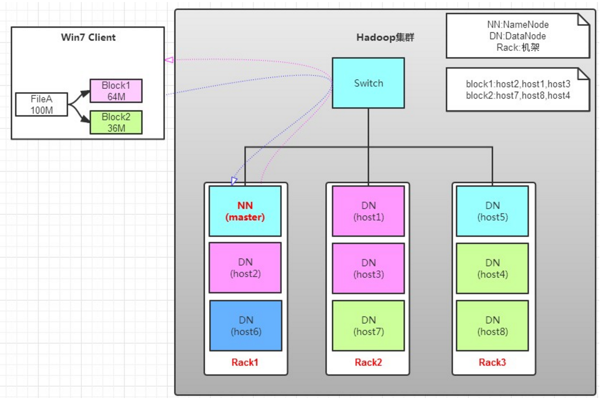

###### 使用

1. 列出HDFS下的文件
```
bin/hadoop dfs -ls
```
2. 上传文件

```
// 将hadoop目录下的test1文件上传到HDFS上并重命名为test：
bin/hadoop dfs -put test1 test
```
3. 文件复制到本地系统中
```
// 将HDFS中的in文件复制到本地系统并命名为getin：
bin/hadoop dfs -get in getin
```
4. 删除文件
```
// 删除HDFS下名为out的文档：
bin/hadoop dfs -rmr out
```
5. 查看文件
```
// 查看HDFS下in文件中的内容：
bin/hadoop dfs -cat in/*
```
6. 建立目录
```
bin/hadoop dfs -mkdir /user/hadoop/examples（目录/目录名）
```
7. 复制文件
```
bin/hadoop dfs -copyFromLocal 源路径 路径
```

#### GlusterFS

资料主要参考[GlusterFS官方文档](http://gluster.readthedocs.io/en/latest/Quick-Start-Guide/Architecture/)和[该博客](http://blog.csdn.net/liuaigui/article/details/6284551)

GlusterFS是Scale-Out存储解决方案Gluster的核心，它是一个开源的分布式文件系统，具有强大的横向扩展能力，通过扩展能够支持数PB存储容量和处理数千客户端。GlusterFS借助TCP/IP或InfiniBand RDMA网络将物理分布的存储资源聚集在一起，使用单一全局命名空间来管理数据。GlusterFS基于可堆叠的用户空间设计，可为各种不同的数据负载提供优异的性能。

GlusterFS的主要特征如下:

* 扩展性和高性能
* 高可用性
* 全局统一命名空间
* 弹性哈希算法
* 弹性卷管理
* 基于标准协议

###### 技术特点

* 完全软件实现
* 完整的存储操作系统栈
* 用户空间实现
* 模块化堆栈式架构
* 原始数据格式存储
* 无元数据服务设计

###### GlusterFS架构

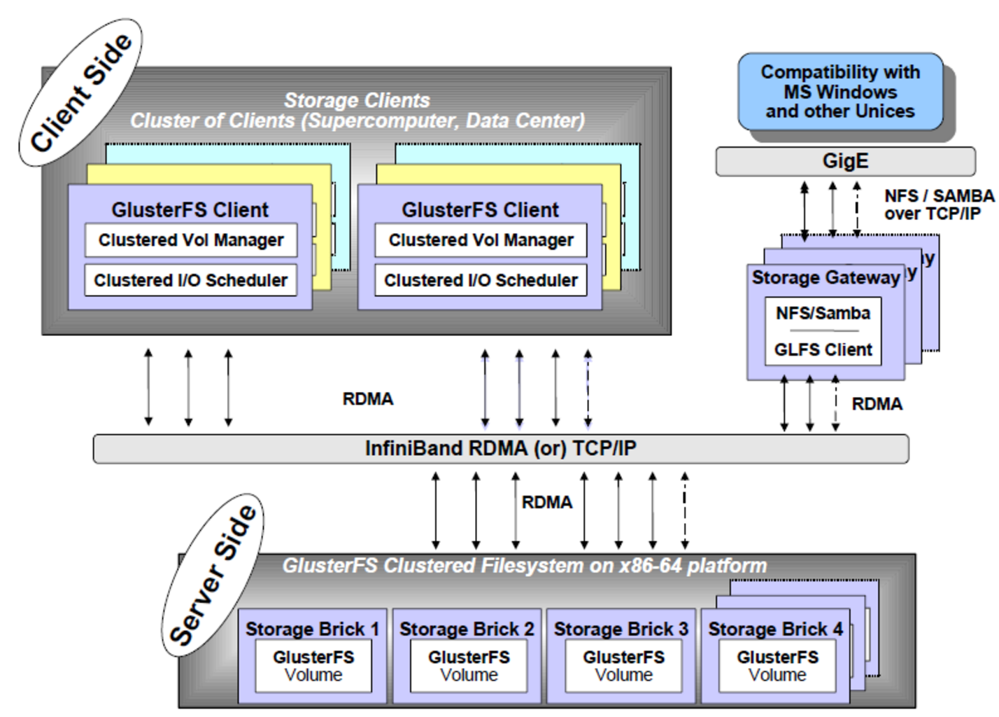

GlusterFS主要由存储服务器（Brick Server）、客户端以及NFS/Samba存储网关组成。GlusterFS架构中没有元数据服务器组件，这是其最大的设计这点，对于提升整个系统的性能、可靠性和稳定性都有着决定性的意义。

存储服务器主要提供基本的数据存储功能，最终的文件数据通过统一的调度策略分布在不同的存储服务器上。它们上面运行着Glusterfsd进行，负责处理来自其他组件的数据服务请求。数据以原始格式直接存储在服务器的本地文件系统上，如EXT3、EXT4、XFS、ZFS等，运行服务时指定数据存储路径。

由于没有了元数据服务器，客户端承担了更多的功能，包括数据卷管理、I/O调度、文件定位、数据缓存等功能。客户端上运行Glusterfs进程，它实际是Glusterfsd的符号链接，利用FUSE（File system in User Space）模块将GlusterFS挂载到本地文件系统之上，实现POSIX兼容的方式来访问系统数据。

GlusterFS存储网关提供弹性卷管理和NFS/CIFS访问代理功能，其上运行Glusterd和Glusterfs进程，两者都是Glusterfsd符号链接。卷管理器负责逻辑卷的创建、删除、容量扩展与缩减、容量平滑等功能，并负责向客户端提供逻辑卷信息及主动更新通知功能等。

###### 卷类别

* Distributed 分布卷：完整文件放在不同的brick中，整个系统中只有一份
* Replicated 复制卷：每个brick一份所有文件的副本
* Distributed Replicated 分布复制卷：分布卷中有不同的复制卷
* Striped 条带卷：单个文件分散在不同的brick当中，在同一个brick中也是分散存储的
* Distributed Striped 分布条带卷：分布卷中有不同的条带卷 

###### 使用

在使用前需要先配置trusted pool以及设置GlusterFS volume。使用时直接在客户端挂载到一个目录，通过此目录操作。

1. 服务器结点
```
gluster peer status         //查看所有结点信息
gluster peer probe NODE-NAME   //添加结点
gluster peer detach NODE-NAME  //移除结点
```
2. GlusterFS服务
```
service gluster start   //启动gluster服务
service gluster stop    //关闭gluster服务
service gluster status  //查看gluster服务
```
3. 卷管理（以复制卷为例）
```
// 创建卷
 gluster volume create NEW-VOLNAME [replica COUNT] [transport tcp | rdma | tcp, rdma] NEW-BRICK
// 启动卷
gluster volume start VOLUME-NAME
// 停止卷
gluster volume stop VOLUME-NAME
// 删除卷
gluster volume delete VOLUME-NAME
```

#### AUFS

参考[该博客](https://www.centos.bz/2016/12/aufs-storage-driver-in-practice/)

###### 分层和共享

AUFS是一个统一文件系统。它管理着单台Linux主机上的多个目录，把它们互相堆叠并提供一个统一视图。AUFS使用了联合挂载(union mount)。

AUFS堆叠多个目录并通过一个联合挂载来提供一个统一的视图。堆栈中的所有目录以及联合挂载点必须都存在于同一Linux主机上。AUFS引用作为分支堆叠的每个目录。

在Docker中，AUFS联合挂载支持镜像分层。AUFS存储驱动使用联合挂载系统来实现Docker的镜像分层。AUFS分支对应Docker镜像数据层。下图显示基于ubuntu\:latest镜像的docker容器

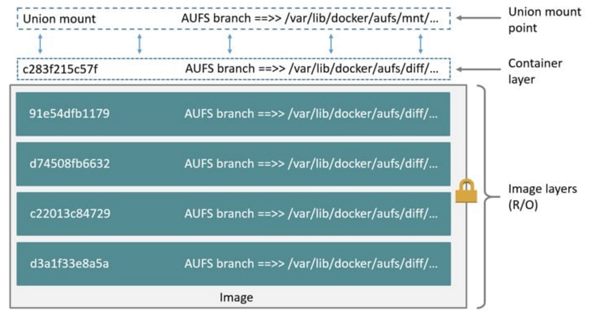

###### 读写

Docker利用AUFS CoW技术实现镜像共享并最小化磁盘空间的使用。AUFS操作在文件级别上。意味着AUFS CoW技术将复制整个文件 – 即使是只更改一个文件的一小部分。此行为对容器性能有显着影响，特别是要复制的文件非常大，文件在层级很多的数据层下或者CoW操作必须搜索深度目录树。

例如，运行在容器中的一个程序需要添加一个新的值到一个大的键值存储文件。如果是首次更改这个文件，它还没有在容器的顶部可写数据层。那么CoW必须从底层镜像复制出这个文件。AUFS存储驱动在每个镜像数据层搜索这个文件。搜索的顺序是从上到下。当找到后，复制整个文件到容器的顶部可写数据层。之后才能打开和修改这个文件了。

大的文件复制需要的时间明显比小的文件要多，存在于较低数据层的文件比在较高数据层的文件所需时间多。不过，在任何一个容器中的文件只会产生一次copy-up操作。随后的这个文件的读和写都发生在容器的顶部数据层。

###### 删除

AUFS存储驱动通过在容器数据层放置一个空白(whiteout)文件来从容器删除一个文件。空白文件有效地掩盖了下面的只读镜像层中文件的存在。下图显示了基于3个数据层的镜像的容器。

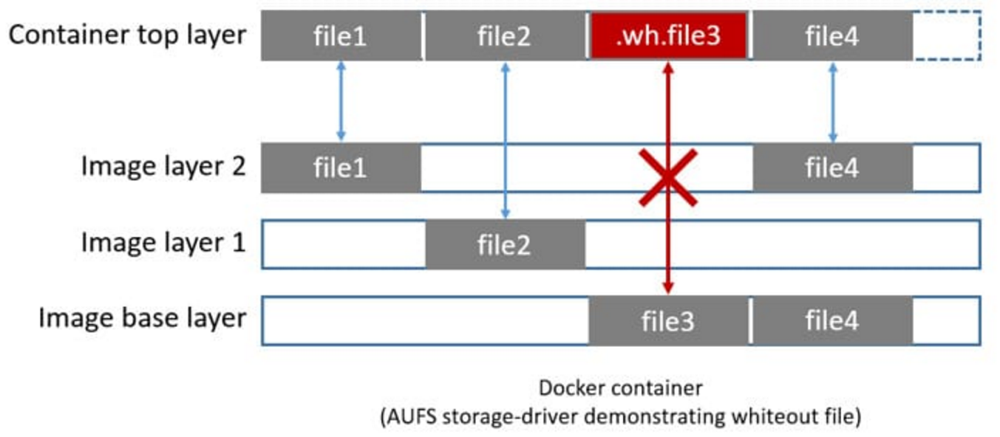

file3已经从容器中删除。因此AUFS存储驱动放置一个空白文件到容器数据层。这个空白文件通过隐藏镜像只读数据层中的任意原始文件的存在来有效地“删除”了容器的file3文件。

###### 使用

```
mount -t aufs -o br=(upper)=rw:(base)=ro+wh none (rootfs)
```


## 2. 安装配置一种分布式文件系统，启动容错机制

安装的分布式文件系统是GlusterFS。

安装过程主要参考GlusterFS的[官网文档](http://gluster.readthedocs.io/en/latest/Quick-Start-Guide/Quickstart/)以及[该博客](http://www.itzgeek.com/how-tos/linux/ubuntu-how-tos/install-and-configure-glusterfs-on-ubuntu-16-04-debian-8.html)

#### 1. 配置hosts
```
sudo vim /etc/hosts

172.16.1.172    gluster1.local        gluster1
172.16.1.113    gluster2.local        gluster2
172.16.1.157    gluster3.local        gluster3
```

#### 2. 加入GlusterFS仓库
```
sudo apt-get install -y software-properties-common
sudo add-apt-repository ppa:gluster/glusterfs-3.10
```
#### 3. 安装GlusterFS

更新软件源

```
sudo apt-get update
```
安装GlusterFS软件包
```
sudo apt-get install -y glusterfs-server
```
在每个gluster结点上运行glusterfs service
```
sudo service glusterfs-server start
```
确认glusterfs service运行良好

```
pkusei@oo-lab:~$ sudo service glusterfs-server status

● glusterfs-server.service - LSB: GlusterFS server
   Loaded: loaded (/etc/init.d/glusterfs-server; bad; vendor preset: enabled)
   Active: active (running) since Sat 2017-04-15 11:44:49 EDT; 1min 59s ago
     Docs: man:systemd-sysv-generator(8)
   CGroup: /system.slice/glusterfs-server.service
           └─49460 /usr/sbin/glusterd -p /var/run/glusterd.pid

Apr 15 11:44:46 oo-lab systemd[1]: Starting LSB: GlusterFS server...
Apr 15 11:44:46 oo-lab glusterfs-server[49451]:  * Starting glusterd service glusterd
Apr 15 11:44:49 oo-lab glusterfs-server[49451]:    ...done.
Apr 15 11:44:49 oo-lab systemd[1]: Started LSB: GlusterFS server.
Apr 15 11:46:18 oo-lab systemd[1]: Started LSB: GlusterFS server.
```

#### 4. 配置GlusterFS

创建信任存储池(trusted storage pool),这里以gluster1的操作为例
```
sudo gluster peer probe gluster2.local
sudo gluster peer probe gluster3.local
```
当返回``peer probe: success``则添加成功
查看当前trusted peer pool的状态
```
pkusei@oo-lab:~/workspace$ sudo gluster peer status

Number of Peers: 2

Hostname: gluster2.local
Uuid: 8bab77c6-5e28-4d62-a041-2d28697f3863
State: Peer in Cluster (Connected)

Hostname: gluster3.local
Uuid: bf215177-46fd-4225-9c7f-2c1266782599
State: Peer in Cluster (Connected)
```

#### 5. 创建GlusterFS卷

在每个结点上创建一个名为“gvol0”的目录
```
sudo mkdir -p ./gluster/gvol0
```
在每个结点上创建名为“gvol0”的复制卷
```
sudo gluster volume create gvol0 replica 3 \ gluster1.local:/home/pkusei/workspace/gluster/gv ol0 \ gluster2.local:/home/pkusei/workspace/gluster/gvol0 \ gluster3.local:/home/pkusei/workspace/gluster/gvol0 force

```
启动
```
sudo gluster volume start gvol0
```
检查volume状态
```
pkusei@oo-lab:~/workspace$ sudo gluster volume info gvol0

Volume Name: gvol0
Type: Replicate
Volume ID: 9f292447-da95-4fec-b302-554de89d2ff1
Status: Started
Snapshot Count: 0
Number of Bricks: 1 x 3 = 3
Transport-type: tcp
Bricks:
Brick1: gluster1.local:/home/pkusei/workspace/gluster/gvol0
Brick2: gluster2.local:/home/pkusei/workspace/gluster/gvol0
Brick3: gluster3.local:/home/pkusei/workspace/gluster/gvol0
Options Reconfigured:
transport.address-family: inet
nfs.disable: on
```
#### 6. 测试GlusterFS卷

用1001当作客户端，先将卷挂载到``/mnt``,然后在里面创建100个文件
```
sudo mount -t glusterfs gluster1.local:/gvol0 /mnt
for i in `seq -w 1 100`; do touch /mnt/copy-test-$i; done
```
先检查/mount

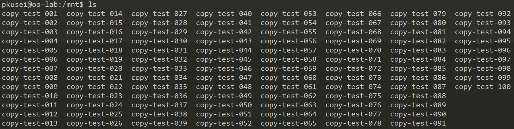

几秒钟后检查每个结点的GlusterFS挂载点

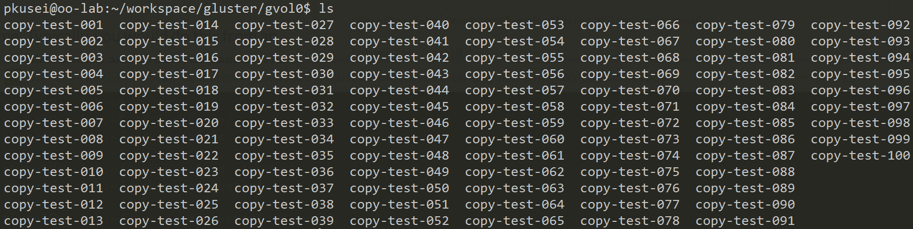

配置成功

#### 7. 容错机制

由于此处使用的是复制卷，在每个结点都会存储所有文件的副本，因此即使一台机器宕机，其它机器也能正常使用GlusterFS中的文件

           
## 3. 将Web主页放在分布式文件系统，在Docker容器启动时挂载到容器里

#### 1. 将编辑好的网页存入GlusterFS

直接使用之前创建好的卷，由于已经挂载到1001的``/mnt``目录，直接放入``/mnt``即可

```
sudo mv index.html /mnt
```
使用另一台机器查看GlusterFS，网页以成功放入GlusterFS

#### 2. 从上次作业保存的镜像生成容器

在``docker run``的时候加入``-v``选项，将GlusterFS挂载到容器的指定目录；并设置端口转发
```
sudo docker run -p 80:80 -v  /home/pkusei/workspace/gluster/gvol0:/var/www/html --name="nginx_gluster" esddse/nginx /bin/bash
```
#### 3. 启动nginx
```
sudo docker exec nginx_gluster nginx
```

#### 4. 通过浏览器检查结果

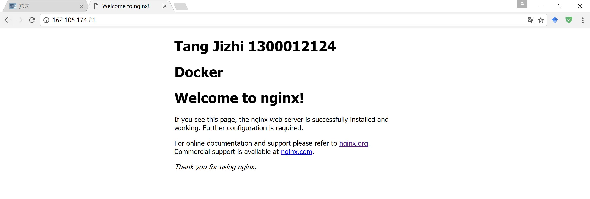

也可以通过访问[162.105.174.21](http://162.105.174.21/)来看到结果


## 4. 了解Docker的镜像机制，仿照其工作机制完成一次镜像的操作

#### Docker镜像机制

参考[该博客](http://blog.csdn.net/x931100537/article/details/49633107)，这篇博客从底层原理的角度很好地解释了容器和镜像的区别与联系

镜像（Image）就是一堆只读层（read-only layer）的统一视角，也许这个定义有些难以理解，下面的这张图能够帮助读者理解镜像的定义。

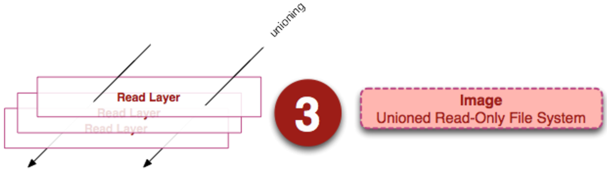

从左边我们看到了多个只读层，它们重叠在一起。除了最下面一层，其它层都会有一个指针指向下一层。这些层是Docker内部的实现细节，并且能够在主机（译者注：运行Docker的机器）的文件系统上访问到。统一文件系统（union file system）技术能够将不同的层整合成一个文件系统，为这些层提供了一个统一的视角，这样就隐藏了多层的存在，在用户的角度看来，只存在一个文件系统。我们可以在图片的右边看到这个视角的形式。

容器与镜像的区别，在于在其之上加入了一个可读写层，下图是一个容器的表示图

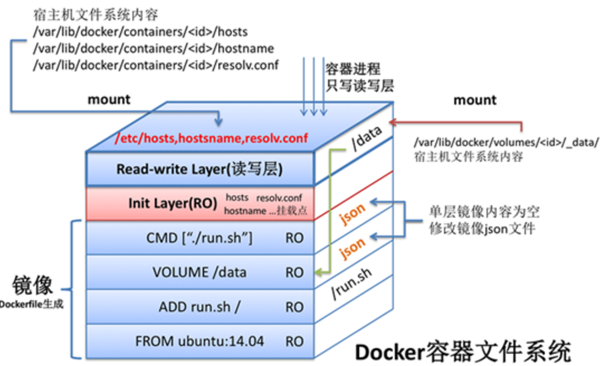

#### Docker镜像制作

###### 1. 新建镜像

以ubuntu为基础新建一个镜像，并运行容器
```
sudo docker run -it --name="my_image" ubuntu:latest /bin/bash
```
进入该容器，下载两个软件
```
apt-get update
apt-get install vim
apt-get install nano
```
###### 2. 找到文件系统并保存
新开一个终端，在Docker宿主机上使用``df -a``命令查看挂载，新增的条目如下
```
none                                 -       -         -    - /var/lib/docker/aufs/mnt/8bca753e8daa846e5828a673f40803f9d4e3e94150aced28823370b5c0a8114b
shm                                  -       -         -    - /var/lib/docker/containers/3cf1f9b322120861cf3f1c39b2c4502539a0b4da88a4e33141634aceb962d651/shm
nsfs                                 -       -         -    - /run/docker/netns/2422676c400c
```
进入目录``/var/lib/docker/aufs/layers``查看文件层次
```
root@oo-lab:~# cd /var/lib/docker/aufs/layers
root@oo-lab:/var/lib/docker/aufs/layers# cat 8bca753e8daa846e5828a673f40803f9d4e3e94150aced28823370b5c0a8114b

8bca753e8daa846e5828a673f40803f9d4e3e94150aced28823370b5c0a8114b-init
6b0240c6e20487f4a21825d5de647cebffbb614374fae2040d0c8dea8e2136a9
e95e8d96321fd5774dd3836a7877ba523b6a729f91c888bdbd75021a98273638
47aa480a347e1ee31156b1b1c7a8b425cff85489505c511906d472f73e7c60ba
179e3e98b8ce1fb40c70e410140bfdf4f6a14f66e4321c4073fbd655e5ae856d
aba1defd56fddc42e8b1c5b79138d834438793ce504a261f075f1b17cb6b3708
```
其中``8bca753``是最上层的读写层，而``8bca753-init``是init layer （可以对应前面Docker成像机制的图）

文件均存放在``/var/lib/docker/aufs/diff``中，进入该目录并且保存相应层，其中init层和容器创建有关，不需要保存。将读写层保存为新镜像的最上层。
```
root@oo-lab:/var/lib/docker/aufs/layers# cd /var/lib/docker/aufs/diff/
root@oo-lab:/var/lib/docker/aufs/diff# cp -r aba1defd56fddc42e8b1c5b79138d834438793ce504a261f075f1b17cb6b3708/ /home/pkusei/workspace/my_image/layer_0
root@oo-lab:/var/lib/docker/aufs/diff# cp -r 179e3e98b8ce1fb40c70e410140bfdf4f6a14f66e4321c4073fbd655e5ae856d/ /home/pkusei/workspace/my_image/layer_1
root@oo-lab:/var/lib/docker/aufs/diff# cp -r 47aa480a347e1ee31156b1b1c7a8b425cff85489505c511906d472f73e7c60ba/ /home/pkusei/workspace/my_image/layer_2
root@oo-lab:/var/lib/docker/aufs/diff# cp -r e95e8d96321fd5774dd3836a7877ba523b6a729f91c888bdbd75021a98273638/ /home/pkusei/workspace/my_image/layer_3
root@oo-lab:/var/lib/docker/aufs/diff# cp -r 6b0240c6e20487f4a21825d5de647cebffbb614374fae2040d0c8dea8e2136a9/ /home/pkusei/workspace/my_image/layer_4
root@oo-lab:/var/lib/docker/aufs/diff# cp -r 8bca753e8daa846e5828a673f40803f9d4e3e94150aced28823370b5c0a8114b /home/pkusei/workspace/my_image/layer_5
```

###### 3. 通过aufs挂载

镜像所有的层都是readonly模式
```
 mount -t aufs -o br=\
 /home/pkusei/workspace/my_image/layer_5=ro:\
 /home/pkusei/workspace/my_image/layer_4=ro:\
 /home/pkusei/workspace/my_image/layer_3=ro:\
 /home/pkusei/workspace/my_image/layer_2=ro:\
 /home/pkusei/workspace/my_image/layer_1=ro:\
 /home/pkusei/workspace/my_image/layer_0=ro \
 none /home/pkusei/workspace/mnt
```
检查``/home/pkusei/workspace/mnt``

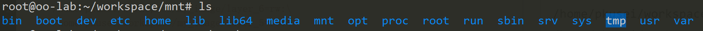

能看到所有层的文件，成功挂载！

###### 4. 制作镜像，生成容器

通过``docker import``命令导入该镜像
```
cd /home/pkusei/workspace/mnt
tar -c . | docker import - my_image
```
使用``docker images``命令发现生成了新的镜像
```
root@oo-lab:~/workspace# docker images

REPOSITORY          TAG                 IMAGE ID            CREATED             SIZE
my_image            latest              b36e3c0cb7e4        7 minutes ago       204 MB
esddse/nginx        latest              27ac3179b2c7        26 hours ago        370 MB
ubuntu              latest              6a2f32de169d        4 days ago          117 MB
hello-world         latest              48b5124b2768        3 months ago        1.84 kB
```
生成容器并运行
```
docker run -it --name="my_image_container" my_image /bin/bash
```
测试vim以及nano，可以使用，说明镜像制作成功

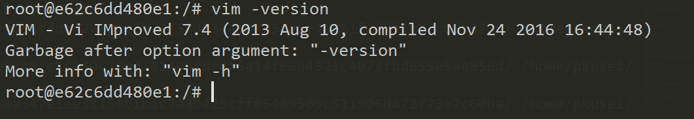
